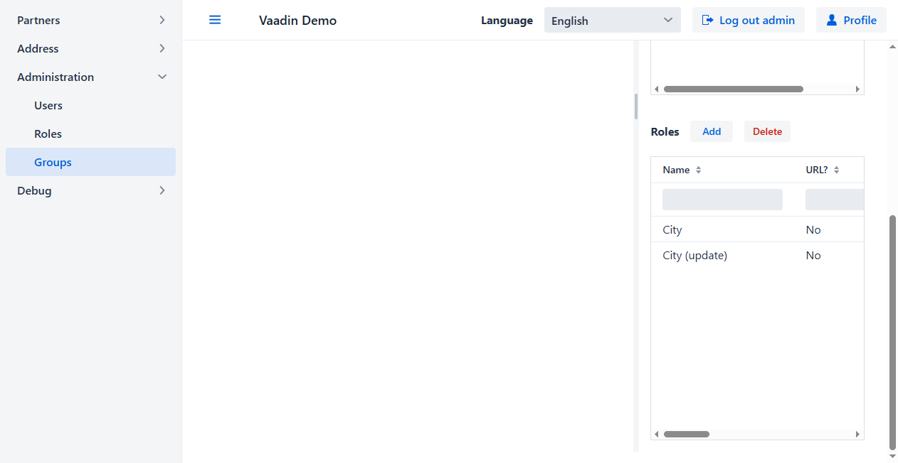
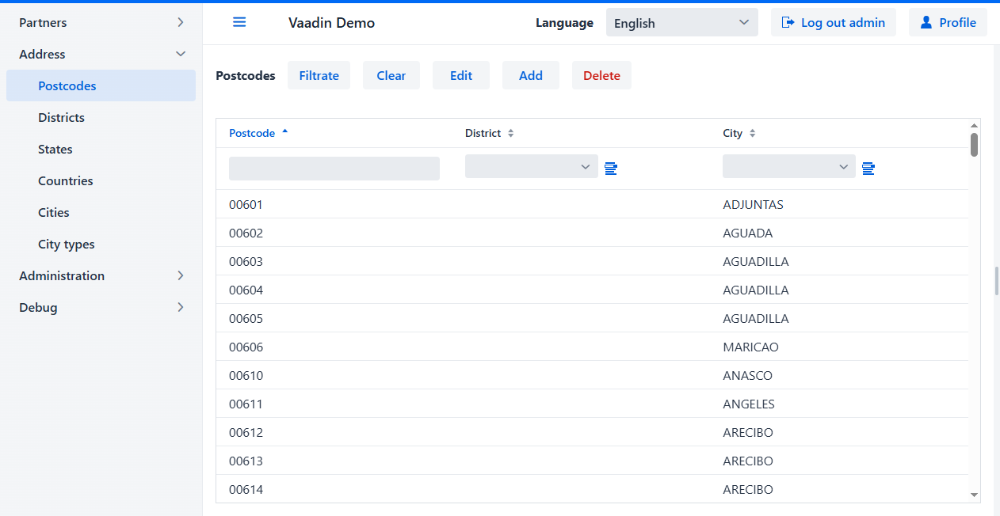

<h1 align="center">biz.softfor.vaadin.demo</h1>

— [Vaadin](https://vaadin.com) application for demonstrating the capabilities
of the [SoftFor.Biz](http://softfor.biz) framework.

## Build and run

For reasons that are not entirely clear, I recommend that you first build the
project using the commands in [rebuild.bat](rebuild.bat), and launch it using
[run.bat](run.bat). Subsequent builds and launches proceed normally, including
using the IDE and in debug mode. Also use these commands when updating the
Vaadin version.

## Description

The screenshots below are from running the
[test](src/test/java/biz/softfor/vaadin/user/AccessSeTest.java) using
[Selenium](https://www.selenium.dev). So what's going on here:

- With the initial data for the test, viewing and editing the ***Cities***
directory is available only to users of the ***CITIES_EDITORS*** group. Thus,
the menu item ***Address* -> *Cities*** and the ***City*** column in the
***Postcodes*** table are not available to unauthorized users:

- User ***admin*** is logging in:

- Since ***admin*** is not included in the ***CITIES_EDITORS*** group, the data
from the ***Cities*** table is also unavailable to him:

- Go to the menu ***Administration -> Groups***:

- We select the group ***CITIES_EDITORS*** and see that there are no users in it:

- Double-click or press the **Edit** button to open editing for the selected
entry:

- Open the list of users not in the ***CITIES_EDITORS*** group:

- In the **Username** field filter, enter the name of the user we want to find:

- After pressing the **Filtrate** button, we see the only line that satisfies
the entered filter:

- We mark it and press the **Select** button:

- User ***admin*** has been added to the ***CITIES_EDITORS*** group:

- Members of the ***CITIES_EDITORS*** group can both read ***City*** entities
and update them - i.e. they have the ***City*** and ***City (update)*** roles:

- Click the **Save** button:

- After saving, we see that the ***CITIES_EDITORS*** group has a user
***admin***, and it contains the roles ***City*** and ***City (update)***:

- For the changes to take effect, the user must log out and log in to the
application again. Since the menu item ***Administration -> Groups*** is not
available to unauthorized users, after logging out it is displayed that such a
page is not found:

- After the user logs in as ***admin***, he has access to both the
***Address -> Cities*** item and the ***Postcodes -> City*** column:

## License

This project is licensed under the MIT License - see the [license.md](license.md) file for details.
