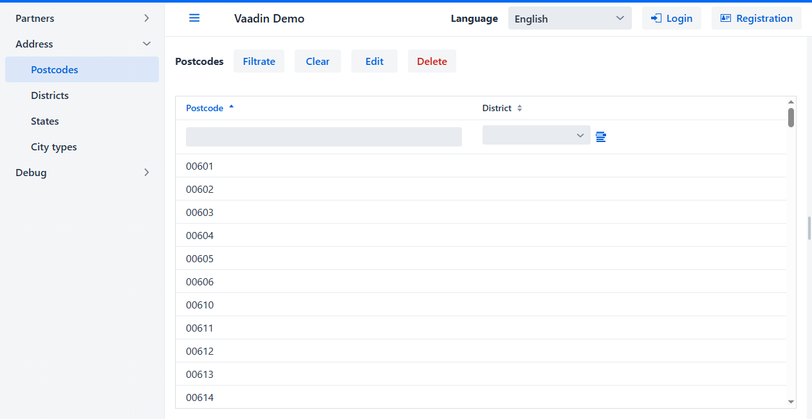
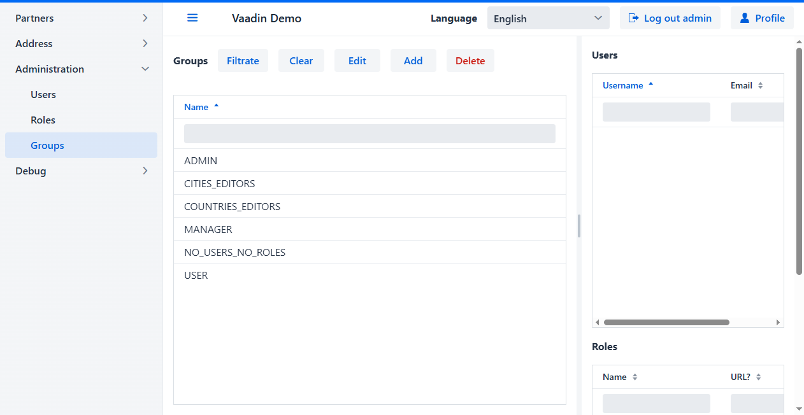
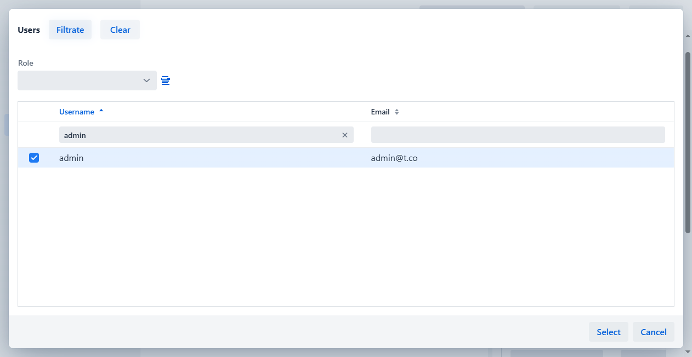

  <a href="readme.ua.md">UA</a>
  <a href="readme.md">EN</a>

<h1 align="center">biz.softfor.vaadin.demo</h1>

— [Vaadin](https://vaadin.com) приложение для демонстрации возможностей
фреймворка [softfor.biz](http://softfor.biz).

## Сборка и запуск

В силу не ясных до конца причин рекомендую первую сборку проекта выполнить
посредством команд в [rebuild.bat](rebuild.bat), а запуск - [run.bat](run.bat).
Последующие сборки и запуски проходят нормально, в том числе с помощью IDE и в
режиме отладки. Также используйте эти команды и при обновлении версии Vaadin.

## Описание

Приводимые скриншоты получены в результате запуска
[теста](src/test/java/biz/softfor/vaadin/user/AccessSeTest.java) с
использованием [Selenium](https://www.selenium.dev). Итак, что здесь происходит:

- При начальных для теста данных просмотр и редактирование справочника
***Cities*** доступны лишь пользователям группы ***CITIES_EDITORS***.
Таким образом для неавторизованных пользователей недоступны пункт меню
***Address* -> *Cities*** и колонка ***City*** в таблице ***Postcodes***:

- Логин пользователя ***admin***:

- Так как ***admin*** не включен в группу ***CITIES_EDITORS***, то данные
из таблицы ***Cities*** ему также недоступны:

- Переходим в меню ***Administration -> Groups***:

- Выбираем группу ***CITIES_EDITORS*** и видим, что в ней нет ни одного
пользователя:

- Двойным кликом или нажатием кнопки **Edit** открываем редактирование выбранной
записи:

- Открываем список пользователей, отсутствующих в группе ***CITIES_EDITORS***:

- В фильтр поля **Username** вводим имя пользователя, которого хотим найти:

- После нажатия кнопки **Filtrate** видим единственную строку, удовлетворяющую
введённому фильтру:

- Отмечаем её и нажимаем кнопку **Select**:

- В группу ***CITIES_EDITORS*** добавлен пользователь ***admin***:

- Члены группы ***CITIES_EDITORS*** могут как читать сущности ***City***, так и
обновлять их - т.е. имеют роли ***City*** и ***City (update)***:

- Нажимаем кнопку **Save**:

- После сохранения видим, что в группе ***CITIES_EDITORS*** есть пользователь
***admin***, и она содержит роли ***City*** и ***City (update)***:

- Для вступления в силу внесённых изменений пользователь должен выйти и войти в
приложение снова. Т.к. пункт меню ***Administration -> Groups*** недоступен
неавторизованным пользователям, то после выхода отображается, что такая страница
не найдена:

- После входа пользователя как ***admin***, ему доступен и пункт
***Address -> Cities***, и колонка ***Postcodes -> City***:

## Лицензия

Этот проект имеет лицензию MIT - подробности смотрите в файле [license.md](license.md).
