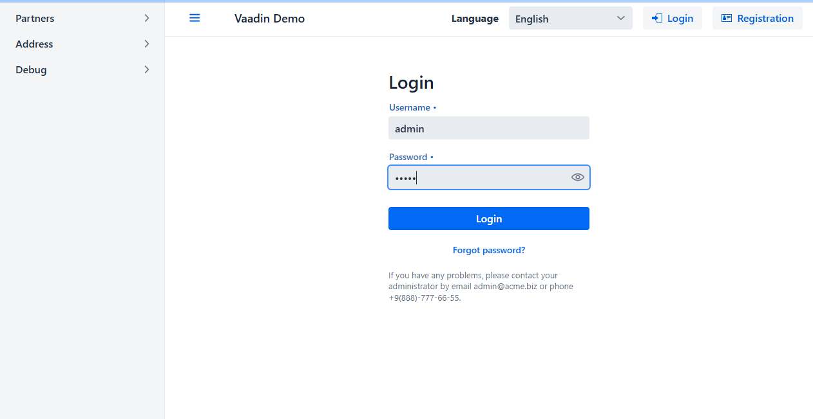
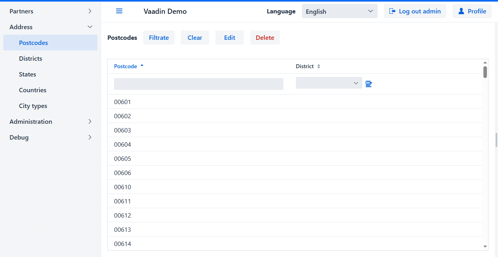
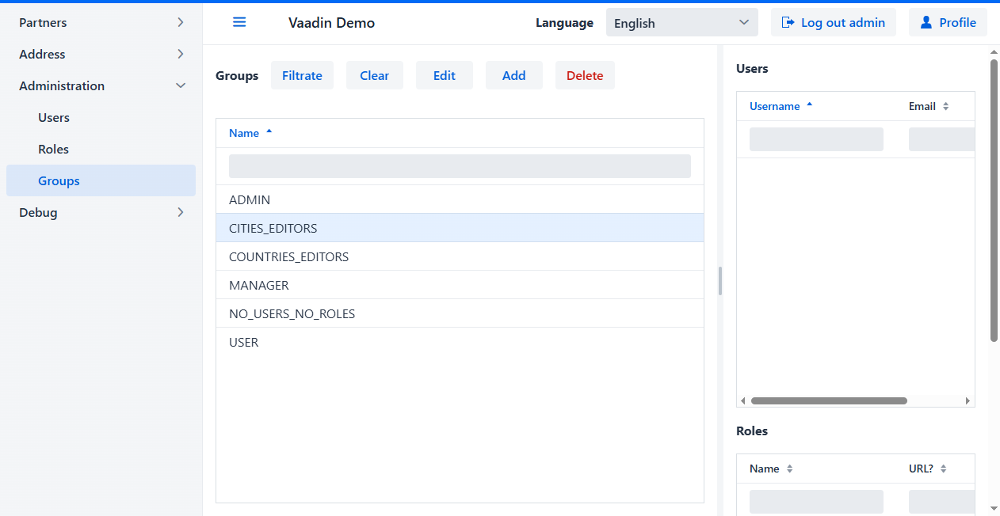
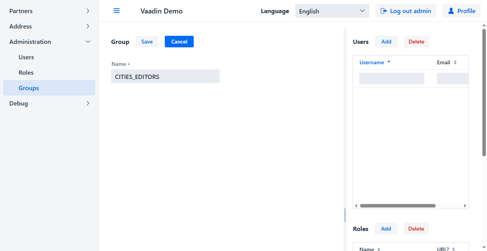
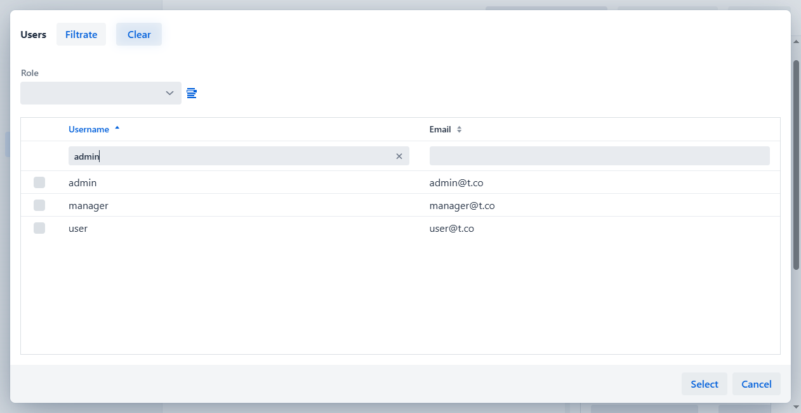
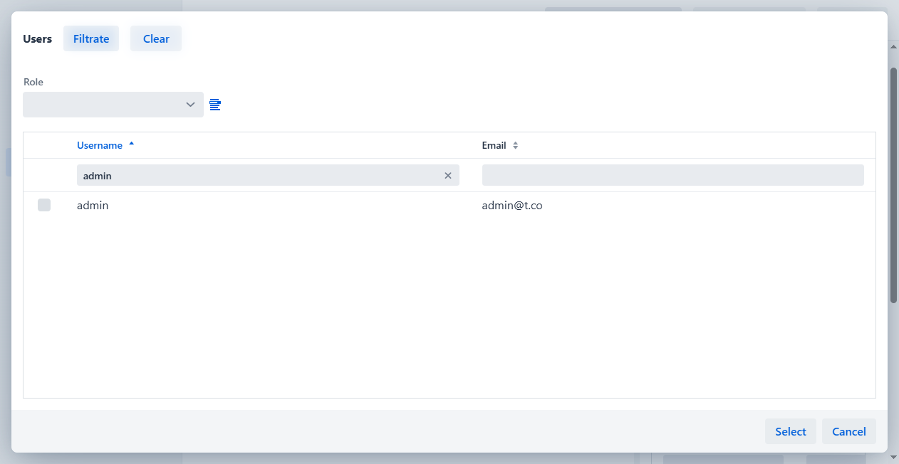

  <a href="readme.md">EN</a>
  <a href="readme.ru.md">RU</a>

<h1 align="center">biz.softfor.vaadin.demo</h1>

— [Vaadin](https://vaadin.com) додаток для демонстрації можливостей фреймворку
[softfor.biz](http://softfor.biz).

## Збирання та запуск

В силу незрозумілих до кінця причин рекомендую першу збірку проекту виконати
за допомогою команд [rebuild.bat](rebuild.bat), а запуск - [run.bat](run.bat).
Наступні зборки та запуски проходять нормально, у тому числі за допомогою IDE та
в режимі налагодження. Також використовуйте ці команди при оновленні версії
Vaadin.

## Опис

Скріншоти отримані в результаті запуску
[тесту](src/test/java/biz/softfor/vaadin/user/AccessSeTest.java) з використанням
[Selenium](https://www.selenium.dev). Отже, що тут відбувається:

- При початкових для тесту даних перегляд та редагування довідника ***Cities***
доступні лише користувачам групи ***CITIES_EDITORS***. Таким чином, для
неавторизованих користувачів недоступні пункт меню ***Address* -> *Cities*** та
колонка ***City*** у таблиці ***Postcodes***:

- Логін користувача ***admin***:

- Оскільки ***admin*** не включений до групи ***CITIES_EDITORS***, дані
з таблиці ***Cities*** йому також недоступні:

- Переходимо в меню ***Administration -> Groups***:

- Вибираємо групу ***CITIES_EDITORS*** і бачимо, що в ній немає жодного
користувача:

- Подвійним кліком або натисканням кнопки **Edit** відкриваємо редагування
обраного рядка:

- Відкриваємо список користувачів, які відсутні у групі ***CITIES_EDITORS***:

- У фільтр поля **Username** вводимо ім'я користувача, якого хочемо знайти:

- Після натискання кнопки **Filtrate** бачимо єдиний рядок, що задовольняє
введеному фільтру:

- Відзначаємо її та натискаємо кнопку **Select**:

- До групи ***CITIES_EDITORS*** доданий користувач ***admin***:

- Члени групи ***CITIES_EDITORS*** можуть як читати сутності ***City***, так і
оновлювати їх – тобто мають ролі ***City*** та ***City (update)***:

- Натискаємо кнопку **Save**:

- Після збереження бачимо, що у групі ***CITIES_EDITORS*** є користувач
***admin***, і вона містить ролі ***City*** та ***City (update)***:

- Для набуття чинності внесених змін користувач повинен вийти та увійти до
додатку знову. Т.к. пункт меню ***Administration -> Groups*** недоступний
неавторизованим користувачам, після виходу відображається, що така сторінка
не знайдена:

- Після входу користувача як ***admin***, йому доступний і пункт
***Address -> Cities***, і колонка ***Postcodes -> City***:

## Ліцензія

Цей проект має ліцензію MIT - подробиці дивіться у файлі [license.md](license.md).
