<p>
  <a href="license.md">
    
  </a>
</p>

<p>
  <a href="readme.ua.md">UA</a>
  <a href="readme.ru.md">RU</a>
</p>
<h1 align="center">biz.softfor.vaadin</h1>


— is a framework based on [Vaadin](https://vaadin.com/components) components and
the base class of the CRUD service
[biz.softfor.spring.jpa.crud](../biz.softfor.spring.jpa.crud) for building
CRUD interfaces for corporate applications. It provides the following
unique features:
- **does not require highly qualified** programmers to create complex
interfaces;
- **minimal amount of required code** for displaying and editing
complex data, including ManyToMany, OneToMany, ManyToOne and OneToOne relations;
- flexible **access control** to menu items, viewing and editing data fields;
- table components with filters and sorting;
- end-to-end **localization** of the application;
- ready-made login, **registration** and **user profile** pages.

## Example

Let's create an interface for working with the **appointments**

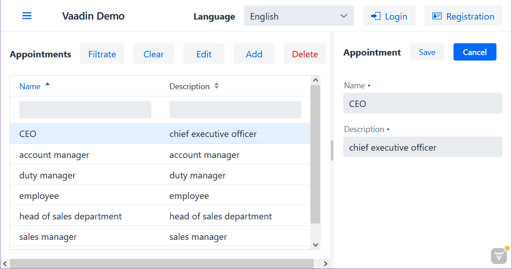

We have an Entity class
**[Appointment](../biz.softfor.partner.jpa/src/main/java/biz/softfor/partner/jpa/Appointment.java)**:
```java
@Entity
@Table(name = Appointment.TABLE)
@Getter
@Setter
@ToString(callSuper = true)
@JsonFilter("Appointment")
public class Appointment extends IdEntity<Short> implements Serializable {

  public final static String TABLE = "appointments";
  public final static String TITLE = "appointment";

  @Column
  @NotBlank
  @Size(min = 2, max = 63)
  private String name;

  @Column
  @NotBlank
  @Size(min = 2, max = 255)
  private String descr;

  private final static long serialVersionUID = 0L;

}
```

and a service for working with the database:
**[AppointmentSvc](../biz.softfor.partner.spring/src/main/java/biz/softfor/partner/spring/AppointmentSvc.java)**
```java
@Service
public class AppointmentSvc
extends CrudSvc<Short, Appointment, AppointmentWor, AppointmentFltr> {}
```
where ***AppointmentWor*** and ***AppointmentFltr*** are classes generated by the
[biz.softfor.jpa.withoutrelationsgen](../biz.softfor.jpa.withoutrelationsgen) and
[biz.softfor.jpa.filtergen](../biz.softfor.jpa.filtergen) annotation processors, respectively, in the
[biz.softfor.partner.jpa.withoutrelations](../biz.softfor.partner.jpa.withoutrelations)
and [biz.softfor.partner.api.filter](../biz.softfor.partner.api.filter) projects.

To implement a full-fledged CRUD interface, we will need the following
Spring components.

Form for creating/editing/viewing
**[AppointmentForm](../biz.softfor.vaadin.demo/src/main/java/biz/softfor/vaadin/partner/AppointmentForm.java)**:
```java
@SpringComponent
@Scope(scopeName = ConfigurableBeanFactory.SCOPE_PROTOTYPE)
public class AppointmentForm
extends EntityForm<Short, Appointment, AppointmentWor> {

  public AppointmentForm(SecurityMgr securityMgr, Validator validator) {
    super(Appointment.TITLE
    , new EntityFormColumns(
        Appointment.class
      , new LinkedHashMap<String, Component>() {{
          TextField name = new TextField(Appointment_.NAME);
          put(Appointment_.NAME, name);
          TextField descr = new TextField(Appointment_.DESCR);
          descr.addBlurListener(e -> {
            if(StringUtils.isBlank(descr.getValue())) {
              descr.setValue(name.getValue());
            }
          });
          put(Appointment_.DESCR, descr);
        }}
      , securityMgr
      )
    , validator
    );
  }

}
```

Next, we will define a list of columns for table display
**[AppointmentDbGridColumns](../biz.softfor.vaadin.demo/src/main/java/biz/softfor/vaadin/partner/AppointmentDbGridColumns.java)**:
```java
@SpringComponent
@Scope(scopeName = ConfigurableBeanFactory.SCOPE_PROTOTYPE)
public class AppointmentDbGridColumns extends DbGridColumns<Short, Appointment> {

  public static List<Order> DEFAULT_SORT
  = List.of(new Order(Order.Direction.ASC, Appointment_.NAME));

  public AppointmentDbGridColumns(SecurityMgr securityMgr) {
    super(
      Appointment.TABLE
    , securityMgr
    , Appointment.class
    , new TextDbGridColumn<>(Appointment_.NAME, AppointmentFltr::setName)
    , new TextDbGridColumn<>(Appointment_.DESCR, AppointmentFltr::setDescr)
    );
  }

  @Override
  public List<Order> sort() {
    return DEFAULT_SORT;
  }

}
```

Component for displaying table data
**[AppointmentsDbGrid](../biz.softfor.vaadin.demo/src/main/java/biz/softfor/vaadin/partner/AppointmentsDbGrid.java)**:
```java
@SpringComponent
@Scope(scopeName = ConfigurableBeanFactory.SCOPE_PROTOTYPE)
public class AppointmentsDbGrid
extends DbGrid<Short, Appointment, AppointmentWor> {

  public AppointmentsDbGrid
  (AppointmentSvc service, AppointmentDbGridColumns columns) {
    super(service, columns, DbGridColumns.EMPTY);
  }

}
```

And finally, class what you see in the screenshot
**[AppointmentsView](../biz.softfor.vaadin.demo/src/main/java/biz/softfor/vaadin/partner/AppointmentsView.java)**:
```java
@SpringComponent
@Scope(scopeName = ConfigurableBeanFactory.SCOPE_PROTOTYPE)
@AnonymousAllowed
@Route(value = AppointmentsView.PATH, layout = MainLayout.class)
public class AppointmentsView
extends EntityView<Short, Appointment, AppointmentWor> {

  public final static String PATH = "appointment";

  public AppointmentsView
  (AppointmentsDbGrid dbGrid, AppointmentForm form, SecurityMgr securityMgr) {
    super(dbGrid, GridFields.EMPTY, form, securityMgr);
  }

}
```
Here the second and third parameters are classes for creating objects of the
corresponding queries, generated by the annotation processor in the project
[biz.softfor.partner.jpa.withoutrelations](../biz.softfor.partner.jpa.withoutrelations),
and the fourth is a list of elements for displaying the ***ManyToMany*** and
***OneToMany*** relations.

## Components of the biz.softfor.vaadin package

- [BasicView](src/main/java/biz/softfor/vaadin/BasicView.java) - a basic View
class that implements the display of the current page title in the browser
depending on the selected language. Usage example:
[NotFoundView](src/main/java/biz/softfor/vaadin/NotFoundView.java).

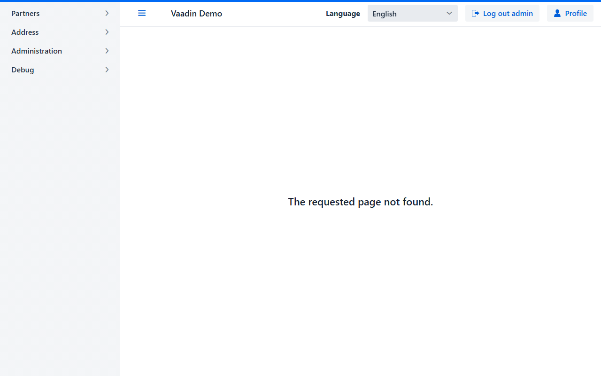

- [EntityForm](src/main/java/biz/softfor/vaadin/EntityForm.java) - displays
a form for creating and editing a record in accordance with the specified
access rights and ensures validation of the entered data in accordance with the
Java Bean Validation annotations. In addition to the above, here is a more
complex example:
[PartnerForm](../biz.softfor.vaadin.demo/src/main/java/biz/softfor/vaadin/partner/PartnerForm.java).


- [EntityFormColumns](src/main/java/biz/softfor/vaadin/EntityFormColumns.java) -
Map of components that are allowed to be viewed and edited. Usage example:
[PartnerForm](../biz.softfor.vaadin.demo/src/main/java/biz/softfor/vaadin/partner/PartnerForm.java#L96).

- [EntityView](src/main/java/biz/softfor/vaadin/EntityView.java) - displays
data in tabular form, including **ManyToMany** and **OneToMany** relations, in
accordance with the specified access rights. Data can be sorted by multiple
columns, filtered by both a column and the contents of multiple columns, or
by a method other than the default. Usage example:
[PartnersView](../biz.softfor.vaadin.demo/src/main/java/biz/softfor/vaadin/partner/PartnersView.java).


- [LangSelector](src/main/java/biz/softfor/vaadin/LangSelector.java) -
select the interface language from the list specified in **application.properties**:
```properties
biz.softfor.locales=en,uk
```
In this case, you must add translated values ​​for the corresponding languages ​​to
the source code of the localization files. Otherwise, during the application
build process, when generating ***.messages** files, the missing values ​​will be
replaced by default values corresponding to the first language in this list.
You will also find warnings in the logs about each such replacement. For more
information, see [biz.softfor.i18nutil](../biz.softfor.i18nutil). Usage example:
[MainLayout](src/main/java/biz/softfor/vaadin/MainLayout.java#L57).

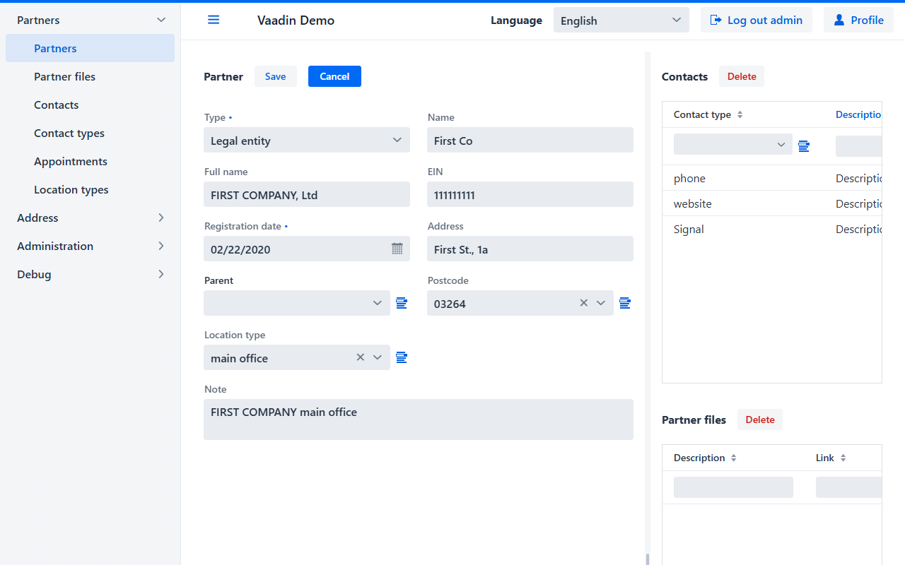

- [MainLayout](src/main/java/biz/softfor/vaadin/MainLayout.java) - includes
the menu, application title, language switcher, login/logout and
registration/profile buttons. Usage example:
[PartnersView](../biz.softfor.vaadin.demo/src/main/java/biz/softfor/vaadin/partner/PartnersView.java#L26).

- [MenuItemData](src/main/java/biz/softfor/vaadin/MenuItemData.java) - contains
data for creating a hierarchical menu. Usage example:
[PartnersView](../biz.softfor.vaadin.demo/src/main/java/biz/softfor/vaadin/demo/App.java#L61).

- [NotFoundView](src/main/java/biz/softfor/vaadin/NotFoundView.java) -
a component with a message that the requested page was not found.

- [SideNavLocalized](src/main/java/biz/softfor/vaadin/SideNavLocalized.java) -
side menu. Usage example as a SideNav inheritor:
[MainLayout](src/main/java/biz/softfor/vaadin/MainLayout.java#L48).

- [Text](src/main/java/biz/softfor/vaadin/Text.java) - common words and phrases
in enterprise applications. These strings are used as keys for the
internationalization subsystem.

## Components of the biz.softfor.vaadin.dbgrid package

- [DbGrid](src/main/java/biz/softfor/vaadin/dbgrid/DbGrid.java) - contains
a tabular display of data with sorting and filtering capabilities,
the ability to delete, create and edit records. Usage example:
[PartnersDbGrid](../biz.softfor.vaadin.demo/src/main/java/biz/softfor/vaadin/partner/PartnersDbGrid.java).

- [DbGridColumn](src/main/java/biz/softfor/vaadin/dbgrid/DbGridColumn.java) -
a base class for components describing a DbGrid column, implementing methods
for displaying and filtering data. Since data filtering requires accessing the
database, it is performed by pressing the "Filtrate" button.

- [DbGridColumns](src/main/java/biz/softfor/vaadin/dbgrid/DbGridColumns.java) -
a list of columns for DbGrid filtered according to access rights. Usage example:
[PartnerDbGridColumns](../biz.softfor.vaadin.demo/src/main/java/biz/softfor/vaadin/partner/PartnerDbGridColumns.java).

This class is also used for filter fields that are not display as grid columns.
For example, here we can use the user filter to select all roles in all groups
for a given user:
[RoleDbGridFilters](../biz.softfor.vaadin.demo/src/main/java/biz/softfor/vaadin/user/RoleDbGridFilters.java#L27)
<p align="center">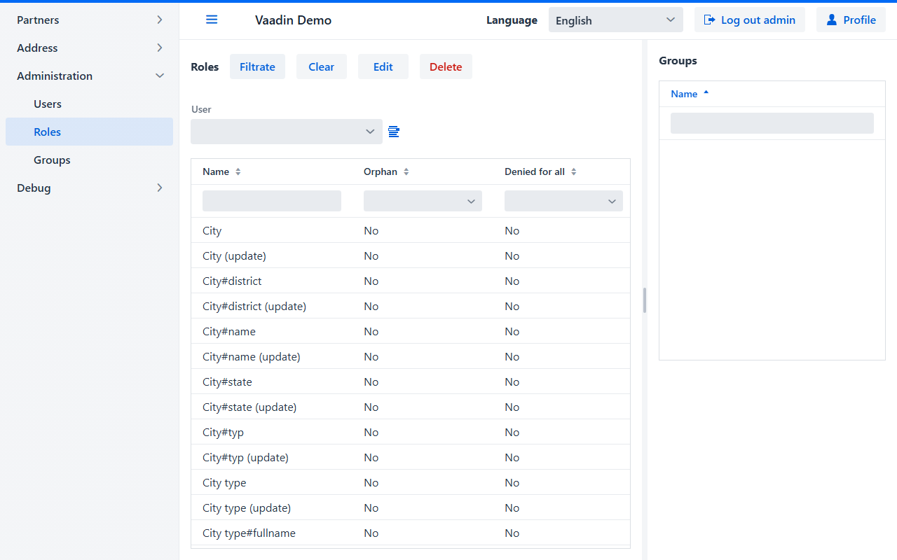</p>

- [BoolDbGridColumn](src/main/java/biz/softfor/vaadin/dbgrid/BoolDbGridColumn.java) -
a component for displaying Boolean values, can have the state "undefined",
necessary for displaying and filtering NULL values. Usage example:
[RoleDbGridColumns](../biz.softfor.vaadin.demo/src/main/java/biz/softfor/vaadin/user/RoleDbGridColumns.java#L33).
<p align="center">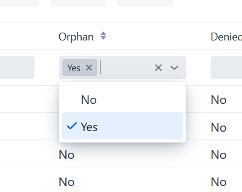</p>

- [DateDbGridColumn](src/main/java/biz/softfor/vaadin/dbgrid/DateDbGridColumn.java) -
component for displaying dates and filtering by range. Usage example:
[PartnerDbGridColumns](../biz.softfor.vaadin.demo/src/main/java/biz/softfor/vaadin/partner/PartnerDbGridColumns.java#L61)
<p align="center">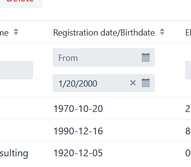</p>

- [ComboBoxDbGridColumn](src/main/java/biz/softfor/vaadin/dbgrid/ComboBoxDbGridColumn.java) -
ComboBox for displaying and filtering sets of values, can have the state
"undefined", which is necessary for displaying and filtering NULL values.
Usage example:
[PartnerDbGridColumns](../biz.softfor.vaadin.demo/src/main/java/biz/softfor/vaadin/partner/PartnerDbGridColumns.java#L56)
<p align="center">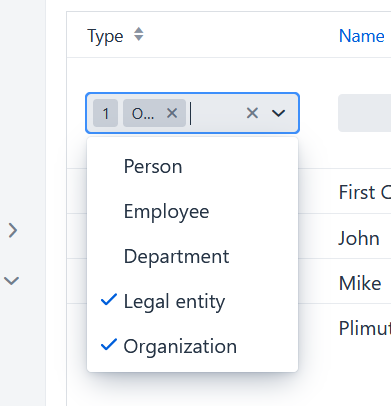</p>

- [ManyToOneDbGridColumn](src/main/java/biz/softfor/vaadin/dbgrid/ManyToOneDbGridColumn.java) -
component for displaying and filtering ManyToOne columns, in other words -
values ​​from the reference table by identifier. Usage example:
[PartnerDbGridColumns](../biz.softfor.vaadin.demo/src/main/java/biz/softfor/vaadin/partner/PartnerDbGridColumns.java#L69)


- [NumberDbGridColumn](src/main/java/biz/softfor/vaadin/dbgrid/NumberDbGridColumn.java) -
component for displaying and filtering Short, Integer and Long values.
Usage example:
[RoleDbGridColumns](../biz.softfor.vaadin.demo/src/main/java/biz/softfor/vaadin/user/RoleDbGridColumns.java#L50).
<p align="center"></p>

- [TextDbGridColumn](src/main/java/biz/softfor/vaadin/dbgrid/TextDbGridColumn.java) -
component for displaying and filtering string values. Usage example:
[RoleDbGridColumns](../biz.softfor.vaadin.demo/src/main/java/biz/softfor/vaadin/user/RoleDbGridColumns.java#L32).
<p align="center"></p>

## Components of the biz.softfor.vaadin.field package

- [DateRangePicker](src/main/java/biz/softfor/vaadin/field/DateRangePicker.java) -
selecting a date range. Usage example:
[DateDbGridColumn](src/main/java/biz/softfor/vaadin/dbgrid/DateDbGridColumn.java#L37)

- [ManyToOneField](src/main/java/biz/softfor/vaadin/field/ManyToOneField.java) -
selecting a value from a reference table. Usage example:
[PartnerForm](../biz.softfor.vaadin.demo/src/main/java/biz/softfor/vaadin/partner/PartnerForm.java#L113).

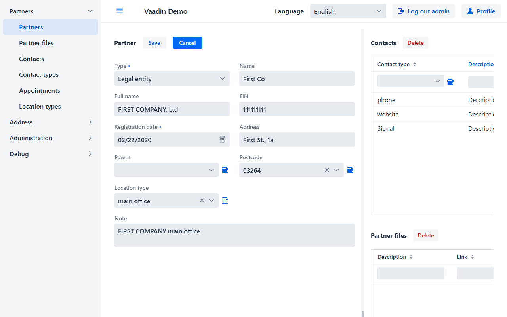

- [ToManyField](src/main/java/biz/softfor/vaadin/field/ToManyField.java) -
displaying and editing the list of **OneToMany** and **ManyToMany** relationships.
Usage example for OneToMany (Contacts):
[PartnerForm](../biz.softfor.vaadin.demo/src/main/java/biz/softfor/vaadin/partner/PartnerForm.java#L135).


And for ManyToMany (Groups):
[UserForm](../biz.softfor.vaadin.demo/src/main/java/biz/softfor/vaadin/user/UserForm.java#L33).


In read-only mode, the delete and add buttons are not available.

## Components of the biz.softfor.vaadin.field.grid package

- [GridField](src/main/java/biz/softfor/vaadin/field/grid/GridField.java) -
contains a tabular display of data with sorting and filtering capabilities.
Unlike DbGrid, it works with data pre-loaded into memory. And therefore the Grid
content is filtered immediately as you type. Usage example (Contacts, Partner
files, Users):
[PartnersView](../biz.softfor.vaadin.demo/src/main/java/biz/softfor/vaadin/partner/PartnersView.java#L45).


- [GridFields](src/main/java/biz/softfor/vaadin/field/grid/GridFields.java) -
a list of GridField fields for displaying related ***ToMany** records together
with DbGrid as part of EntityView. Usage example:
[PartnersView](../biz.softfor.vaadin.demo/src/main/java/biz/softfor/vaadin/partner/PartnersView.java#L42).

- [GridFieldColumn](src/main/java/biz/softfor/vaadin/field/grid/GridFieldColumn.java) -
base class for components that describe a GridField column and implement methods
for displaying and filtering data. Usage example:
[ContactGridFieldColumns](../biz.softfor.vaadin.demo/src/main/java/biz/softfor/vaadin/partner/ContactGridFieldColumns.java#L31).

- [GridFieldColumns](src/main/java/biz/softfor/vaadin/field/grid/GridFieldColumns.java) -
list of columns for GridField filtered according to access rights. Usage example:
[ContactGridFieldColumns](../biz.softfor.vaadin.demo/src/main/java/biz/softfor/vaadin/partner/ContactGridFieldColumns.java).

- [BoolGridFieldColumn](src/main/java/biz/softfor/vaadin/field/grid/BoolGridFieldColumn.java) -
component for displaying boolean values, can have the state "undefined",
necessary for displaying and filtering NULL values. Usage example:
[ContactGridFieldColumns](../biz.softfor.vaadin.demo/src/main/java/biz/softfor/vaadin/partner/ContactGridFieldColumns.java#L47).
<p align="center">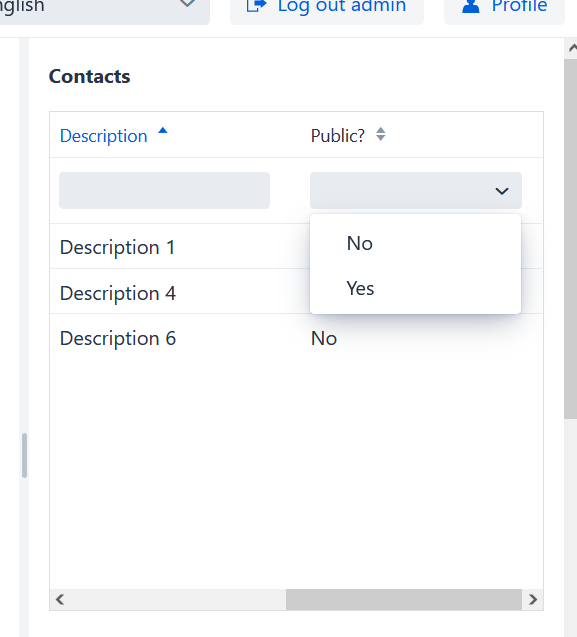</p>

- [ComboBoxGridFieldColumn](src/main/java/biz/softfor/vaadin/field/grid/ComboBoxGridFieldColumn.java) -
ComboBox for displaying and filtering sets of values, can have the state
"undefined", necessary for displaying and filtering NULL values.

- [NumberGridFieldColumn](src/main/java/biz/softfor/vaadin/field/grid/NumberGridFieldColumn.java) -
component for displaying and filtering Short, Integer and Long values.
Usage example:
[RoleGridFieldColumns](../biz.softfor.vaadin.demo/src/main/java/biz/softfor/vaadin/user/RoleGridFieldColumns.java#L36).
<p align="center">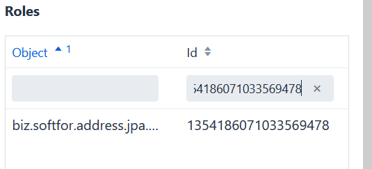</p>

- [TextGridFieldsColumn](src/main/java/biz/softfor/vaadin/field/grid/TextGridFieldsColumn.java) -
component for displaying and filtering string values. Usage example:
[RoleGridFieldColumns](../biz.softfor.vaadin.demo/src/main/java/biz/softfor/vaadin/user/RoleGridFieldColumns.java#L26).
<p align="center"></p>

## Components of the biz.softfor.vaadin.security package

- [LoginView](src/main/java/biz/softfor/vaadin/security/LoginView.java) -
application login page, compiled on the basis of Vaadin LoginForm with the
addition of localization and transition to the original page from which the user
logged in.

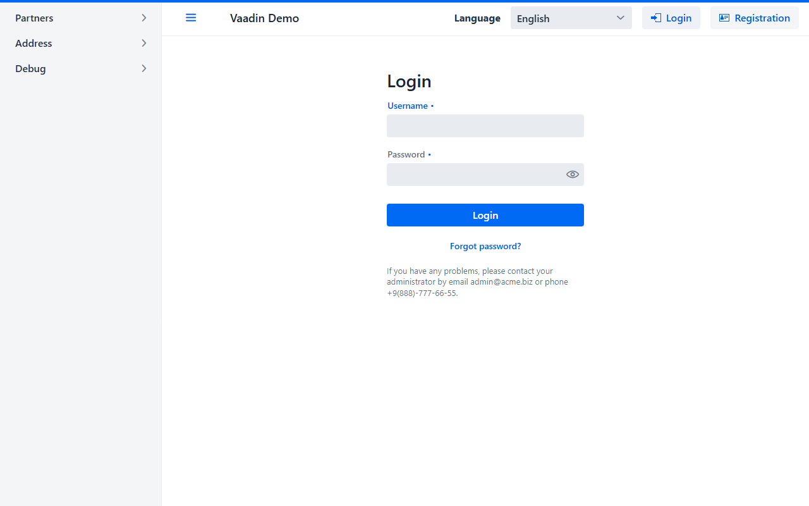

- [ProfileView](src/main/java/biz/softfor/vaadin/security/ProfileView.java) -
allows the user to view and edit their own (and only their own) data. In this
case, it is impossible to see the password, you can only enter a new one.


- [RegistrationView](src/main/java/biz/softfor/vaadin/security/RegistrationView.java) -
new user registration form. In this case, he receives default access rights,
which can only be changed by the administrator.


## License

This project is licensed under the MIT License - see the [license.md](license.md) file for details.
