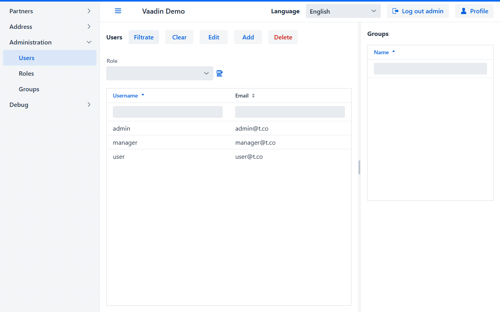

[](license.md)

[](readme.ua.md)
[](readme.md)

<h1 align="center">biz.softfor.vaadin</h1>


— это фреймворк на базе компонентов [Vaadin](https://vaadin.com/components) и
базового классе CRUD-сервиса
[biz.softfor.spring.jpa.crud](../biz.softfor.spring.jpa.crud) для построения
CRUD-интерфейсов корпоративных приложений. Он предоставляет следующие
уникальные возможности:
- **не требует высокой квалификации** программистов для создания сложных
интерфейсов; 
- **минимальное количество необходимого кода** для отображения и редактирования
сложных данных, включая ManyToMany, OneToMany, ManyToOne и OneToOne отношения;
- гибкое **разграничение доступа** к пунктам меню, просмотру и редактированию
полей данных;
- табличные компоненты с фильтрами и сортировкой;
- сквозная **локализация** приложения;
- готовые страницы логина, **регистрации** и **профиля** пользователя.

## Пример

Давайте создадим интерфейс для работы со **справочником должностей**


Имеем Entity-класс
**[Appointment](../biz.softfor.partner.jpa/src/main/java/biz/softfor/partner/jpa/Appointment.java)**:
```java
@Entity
@Table(name = Appointment.TABLE)
@Getter
@Setter
@ToString(callSuper = true)
@JsonFilter("Appointment")
public class Appointment extends IdEntity<Short> implements Serializable {

  public final static String TABLE = "appointments";
  public final static String TITLE = "appointment";

  @Column
  @NotBlank
  @Size(min = 2, max = 63)
  private String name;

  @Column
  @NotBlank
  @Size(min = 2, max = 255)
  private String descr;

  private final static long serialVersionUID = 0L;

}
```

и сервис для работы с БД:
**[AppointmentSvc](../biz.softfor.partner.spring/src/main/java/biz/softfor/partner/spring/AppointmentSvc.java)**
```java
@Service
public class AppointmentSvc
extends CrudSvc<Short, Appointment, AppointmentWor, AppointmentFltr> {}
```
где ***AppointmentWor*** и ***AppointmentFltr*** - классы, сгенерированные
процессорами аннотаций
[biz.softfor.jpa.withoutrelationsgen](../biz.softfor.jpa.withoutrelationsgen) и
[biz.softfor.jpa.filtergen](../biz.softfor.jpa.filtergen) соответственно в
проектах [biz.softfor.partner.jpa.withoutrelations](../biz.softfor.partner.jpa.withoutrelations)
и [biz.softfor.partner.api.filter](../biz.softfor.partner.api.filter).

Для реализации полноценного CRUD-интерфейса нам понадобятся следующие
компоненты Spring.

Форма для создания/редактирования/просмотра
**[AppointmentForm](../biz.softfor.vaadin.demo/src/main/java/biz/softfor/vaadin/partner/AppointmentForm.java)**:
```java
@SpringComponent
@Scope(scopeName = ConfigurableBeanFactory.SCOPE_PROTOTYPE)
public class AppointmentForm
extends EntityForm<Short, Appointment, AppointmentWor> {

  public AppointmentForm(SecurityMgr securityMgr, Validator validator) {
    super(Appointment.TITLE
    , new EntityFormColumns(
        Appointment.class
      , new LinkedHashMap<String, Component>() {{
          TextField name = new TextField(Appointment_.NAME);
          put(Appointment_.NAME, name);
          TextField descr = new TextField(Appointment_.DESCR);
          descr.addBlurListener(e -> {
            if(StringUtils.isBlank(descr.getValue())) {
              descr.setValue(name.getValue());
            }
          });
          put(Appointment_.DESCR, descr);
        }}
      , securityMgr
      )
    , validator
    );
  }

}
```

Далее зададим список колонок для табличного отображения
**[AppointmentDbGridColumns](../biz.softfor.vaadin.demo/src/main/java/biz/softfor/vaadin/partner/AppointmentDbGridColumns.java)**:
```java
@SpringComponent
@Scope(scopeName = ConfigurableBeanFactory.SCOPE_PROTOTYPE)
public class AppointmentDbGridColumns extends DbGridColumns<Short, Appointment> {

  public static List<Order> DEFAULT_SORT
  = List.of(new Order(Order.Direction.ASC, Appointment_.NAME));

  public AppointmentDbGridColumns(SecurityMgr securityMgr) {
    super(
      Appointment.TABLE
    , securityMgr
    , Appointment.class
    , new TextDbGridColumn<>(Appointment_.NAME, AppointmentFltr::setName)
    , new TextDbGridColumn<>(Appointment_.DESCR, AppointmentFltr::setDescr)
    );
  }

  @Override
  public List<Order> sort() {
    return DEFAULT_SORT;
  }

}
```

Компонент для отображения табличных данных
**[AppointmentsDbGrid](../biz.softfor.vaadin.demo/src/main/java/biz/softfor/vaadin/partner/AppointmentsDbGrid.java)**:
```java
@SpringComponent
@Scope(scopeName = ConfigurableBeanFactory.SCOPE_PROTOTYPE)
public class AppointmentsDbGrid
extends DbGrid<Short, Appointment, AppointmentWor> {

  public AppointmentsDbGrid
  (AppointmentSvc service, AppointmentDbGridColumns columns) {
    super(service, columns, DbGridColumns.EMPTY);
  }

}
```

И, наконец, то, что Вы видите на скриншоте, класс
**[AppointmentsView](../biz.softfor.vaadin.demo/src/main/java/biz/softfor/vaadin/partner/AppointmentsView.java)**:
```java
@SpringComponent
@Scope(scopeName = ConfigurableBeanFactory.SCOPE_PROTOTYPE)
@AnonymousAllowed
@Route(value = AppointmentsView.PATH, layout = MainLayout.class)
public class AppointmentsView
extends EntityView<Short, Appointment, AppointmentWor> {

  public final static String PATH = "appointment";

  public AppointmentsView
  (AppointmentsDbGrid dbGrid, AppointmentForm form, SecurityMgr securityMgr) {
    super(dbGrid, GridFields.EMPTY, form, securityMgr);
  }

}
```
Здесь второй и третий параметры - классы для создания объектов соответствующих
запросов, сгенерированные процессором аннотаций в проекте
[biz.softfor.partner.jpa.withoutrelations](../biz.softfor.partner.jpa.withoutrelations),
а четвёртый - список элементов для отображения отношений ***ManyToMany*** и
***OneToMany***.

## Компоненты пакета biz.softfor.vaadin

- [BasicView](src/main/java/biz/softfor/vaadin/BasicView.java) - базовый
View-класс, реализующий отображение заголовка текущей страницы в браузере в
зависимости от выбранного языка. Пример использования:
[NotFoundView](src/main/java/biz/softfor/vaadin/NotFoundView.java).


- [EntityForm](src/main/java/biz/softfor/vaadin/EntityForm.java) - отображает
форму для создания и редактирования записи в соответствии с заданными правами
доступа и обеспечивает валидацию введённых данных в соотвествии с аннотациями
Java Bean Validation. Помимо приведённого выше, вот пример посложнее:
[PartnerForm](../biz.softfor.vaadin.demo/src/main/java/biz/softfor/vaadin/partner/PartnerForm.java).


- [EntityFormColumns](src/main/java/biz/softfor/vaadin/EntityFormColumns.java) -
Map компонентов, разрешённых к просмотру и редактированию. Пример использования:
[PartnerForm](../biz.softfor.vaadin.demo/src/main/java/biz/softfor/vaadin/partner/PartnerForm.java#L96).

- [EntityView](src/main/java/biz/softfor/vaadin/EntityView.java) - отображает
данные в табличной форме, включая **ManyToMany** и **OneToMany** отношения, в
соответствии с заданными правами доступа. Данные могут быть отсортированы
по нескольким колонкам, отфильтрованы как по колонке, так и по содержимому
нескольких колонок либо по отличному от используемого по умолчанию методу.
Пример использования:
[PartnersView](../biz.softfor.vaadin.demo/src/main/java/biz/softfor/vaadin/partner/PartnersView.java).


- [LangSelector](src/main/java/biz/softfor/vaadin/LangSelector.java) - выбор
языка интерфейса из списка, задаваемого в **application.properties**:
```properties
biz.softfor.locales=en,uk
```
При этом у Вас должны быть добавлены переведённые значения для соответствующих
языков в исходный код файлов локализации. Иначе в процессе сборки приложения при
генерации **messages*.properties** файлов недостающие значения будут заменены значениями
по умолчанию, соответствующими первому языку в этом списке. Также в логах Вы
найдёте предупреждения о каждой такой замене. Подробнее об этом смотрите в
[biz.softfor.i18ngen](https://github.com/ovsyannykov/biz.softfor.i18ngen).
Пример использования:
[MainLayout](src/main/java/biz/softfor/vaadin/MainLayout.java#L57).


- [MainLayout](src/main/java/biz/softfor/vaadin/MainLayout.java) - включает в
себя меню, заголовок приложения, переключатель языка, кнопки входа/выхода и
регистрации/профиля. Пример использования:
[PartnersView](../biz.softfor.vaadin.demo/src/main/java/biz/softfor/vaadin/partner/PartnersView.java#L26).

- [MenuItemData](src/main/java/biz/softfor/vaadin/MenuItemData.java) - содержит
данные для создания иерархического меню. Пример использования:
[PartnersView](../biz.softfor.vaadin.demo/src/main/java/biz/softfor/vaadin/demo/App.java#L61).

- [NotFoundView](src/main/java/biz/softfor/vaadin/NotFoundView.java) - компонент
с сообщением, что запрашиваемая страница не найдена.

- [SideNavLocalized](src/main/java/biz/softfor/vaadin/SideNavLocalized.java) -
боковое меню. Пример использования как наследника SideNav:
[MainLayout](src/main/java/biz/softfor/vaadin/MainLayout.java#L48).

- [Text](src/main/java/biz/softfor/vaadin/Text.java) - общеупотребительные слова
и фразы в корпоративных приложениях. Эти строки используются как ключи для
подсистемы интернационализации.

## Компоненты пакета biz.softfor.vaadin.dbgrid

- [DbGrid](src/main/java/biz/softfor/vaadin/dbgrid/DbGrid.java) - содержит
табличное отображение данных с возможностями сортировки и фильтрации,
возможности удаления, создания и редактирования записей. Пример использования:
[PartnersDbGrid](../biz.softfor.vaadin.demo/src/main/java/biz/softfor/vaadin/partner/PartnersDbGrid.java).

- [DbGridColumn](src/main/java/biz/softfor/vaadin/dbgrid/DbGridColumn.java) -
базовый класс для компонентов, описывающих колонку DbGrid, реализующих методы
отображения и фильтрации данных. Так как фильтрация данных требует обращения к
базе данных, то она выполняется по нажатию кнопки "Filtrate".

- [DbGridColumns](src/main/java/biz/softfor/vaadin/dbgrid/DbGridColumns.java) -
отфильтрованный в соответствии с правами доступа список колонок для DbGrid.
Пример использования:
[PartnerDbGridColumns](../biz.softfor.vaadin.demo/src/main/java/biz/softfor/vaadin/partner/PartnerDbGridColumns.java).

Также этот класс используется для полей фильтра, не являющихся отображаемыми
колонками. Например, здесь с помощью фильтра по пользователям мы можем отобрать
все роли во всех группах для заданного пользователя:
[RoleDbGridFilters](../biz.softfor.vaadin.demo/src/main/java/biz/softfor/vaadin/user/RoleDbGridFilters.java#L27)
<p align="center"></p>

- [BoolDbGridColumn](src/main/java/biz/softfor/vaadin/dbgrid/BoolDbGridColumn.java) -
компонент для отображения булевых значений, может иметь состояние
"не определено", необходимое для отображения и фильтрации NULL-значений.
Пример использования:
[RoleDbGridColumns](../biz.softfor.vaadin.demo/src/main/java/biz/softfor/vaadin/user/RoleDbGridColumns.java#L33).
<p align="center"></p>

- [DateDbGridColumn](src/main/java/biz/softfor/vaadin/dbgrid/DateDbGridColumn.java) -
компонент для отображения дат и фильтрации по диапазону. Пример использования:
[PartnerDbGridColumns](../biz.softfor.vaadin.demo/src/main/java/biz/softfor/vaadin/partner/PartnerDbGridColumns.java#L61)
<p align="center"></p>

- [ComboBoxDbGridColumn](src/main/java/biz/softfor/vaadin/dbgrid/ComboBoxDbGridColumn.java) -
ComboBox для отображения и фильтрации наборов значений, может иметь состояние
"не определено", необходимое для отображения и фильтрации NULL-значений.
Пример использования:
[PartnerDbGridColumns](../biz.softfor.vaadin.demo/src/main/java/biz/softfor/vaadin/partner/PartnerDbGridColumns.java#L56)
<p align="center"></p>

- [ManyToOneDbGridColumn](src/main/java/biz/softfor/vaadin/dbgrid/ManyToOneDbGridColumn.java) -
компонент для отображения и фильтрации ManyToOne-колонки, иными словами -
значения из справочника по идентификатору. Пример использования:
[PartnerDbGridColumns](../biz.softfor.vaadin.demo/src/main/java/biz/softfor/vaadin/partner/PartnerDbGridColumns.java#L69)


- [NumberDbGridColumn](src/main/java/biz/softfor/vaadin/dbgrid/NumberDbGridColumn.java) -
компонент для отображения и фильтрации Short, Integer и Long значений.
Пример использования:
[RoleDbGridColumns](../biz.softfor.vaadin.demo/src/main/java/biz/softfor/vaadin/user/RoleDbGridColumns.java#L50).
<p align="center"></p>

- [TextDbGridColumn](src/main/java/biz/softfor/vaadin/dbgrid/TextDbGridColumn.java) -
компонент для отображения и фильтрации строковых значений. Пример использования:
[RoleDbGridColumns](../biz.softfor.vaadin.demo/src/main/java/biz/softfor/vaadin/user/RoleDbGridColumns.java#L32).
<p align="center"></p>

## Компоненты пакета biz.softfor.vaadin.field

- [DateRangePicker](src/main/java/biz/softfor/vaadin/field/DateRangePicker.java) -
выбор диапазона дат. Пример использования:
[DateDbGridColumn](src/main/java/biz/softfor/vaadin/dbgrid/DateDbGridColumn.java#L37)

- [ManyToOneField](src/main/java/biz/softfor/vaadin/field/ManyToOneField.java) -
выбор значения из справочника. Пример использования:
[PartnerForm](../biz.softfor.vaadin.demo/src/main/java/biz/softfor/vaadin/partner/PartnerForm.java#L113).


- [ToManyField](src/main/java/biz/softfor/vaadin/field/ToManyField.java) -
отображение и редактирование списка **OneToMany** и **ManyToMany** связей.
Пример использования для OneToMany (Contacts):
[PartnerForm](../biz.softfor.vaadin.demo/src/main/java/biz/softfor/vaadin/partner/PartnerForm.java#L135).


И для ManyToMany (Groups):
[UserForm](../biz.softfor.vaadin.demo/src/main/java/biz/softfor/vaadin/user/UserForm.java#L33).


В режиме "только для чтения" недоступны кнопки удаления и добавления.

## Компоненты пакета biz.softfor.vaadin.field.grid

- [GridField](src/main/java/biz/softfor/vaadin/field/grid/GridField.java) -
содержит табличное отображение данных с возможностями сортировки и фильтрации.
В отличие от DbGrid работает с предварительно загруженными в память данными.
И поэтому фильтрация содержимого Grid выполняется сразу по мере ввода.
Пример использования (Contacts, Partner files, Users):
[PartnersView](../biz.softfor.vaadin.demo/src/main/java/biz/softfor/vaadin/partner/PartnersView.java#L45).


- [GridFields](src/main/java/biz/softfor/vaadin/field/grid/GridFields.java) -
список полей GridField для отображения связанных ***ToMany** записей совместно с
DbGrid в составе EntityView. Пример использования:
[PartnersView](../biz.softfor.vaadin.demo/src/main/java/biz/softfor/vaadin/partner/PartnersView.java#L42).

- [GridFieldColumn](src/main/java/biz/softfor/vaadin/field/grid/GridFieldColumn.java) -
базовый класс для компонентов, описывающих колонку GridField и реализующих методы
отображения и фильтрации данных. Пример использования:
[ContactGridFieldColumns](../biz.softfor.vaadin.demo/src/main/java/biz/softfor/vaadin/partner/ContactGridFieldColumns.java#L31).

- [GridFieldColumns](src/main/java/biz/softfor/vaadin/field/grid/GridFieldColumns.java) -
отфильтрованный в соответствии с правами доступа список колонок для GridField.
Пример использования:
[ContactGridFieldColumns](../biz.softfor.vaadin.demo/src/main/java/biz/softfor/vaadin/partner/ContactGridFieldColumns.java).

- [BoolGridFieldColumn](src/main/java/biz/softfor/vaadin/field/grid/BoolGridFieldColumn.java) -
компонент для отображения булевых значений, может иметь состояние
"не определено", необходимое для отображения и фильтрации NULL-значений.
Пример использования:
[ContactGridFieldColumns](../biz.softfor.vaadin.demo/src/main/java/biz/softfor/vaadin/partner/ContactGridFieldColumns.java#L47).
<p align="center"></p>

- [ComboBoxGridFieldColumn](src/main/java/biz/softfor/vaadin/field/grid/ComboBoxGridFieldColumn.java) -
ComboBox для отображения и фильтрации наборов значений, может иметь состояние
"не определено", необходимое для отображения и фильтрации NULL-значений.

- [NumberGridFieldColumn](src/main/java/biz/softfor/vaadin/field/grid/NumberGridFieldColumn.java) -
компонент для отображения и фильтрации Short, Integer и Long значений. Пример
использования:
[RoleGridFieldColumns](../biz.softfor.vaadin.demo/src/main/java/biz/softfor/vaadin/user/RoleGridFieldColumns.java#L36).
<p align="center"></p>

- [TextGridFieldsColumn](src/main/java/biz/softfor/vaadin/field/grid/TextGridFieldsColumn.java) -
компонент для отображения и фильтрации строковых значений. Пример использования:
[RoleGridFieldColumns](../biz.softfor.vaadin.demo/src/main/java/biz/softfor/vaadin/user/RoleGridFieldColumns.java#L26).
<p align="center"></p>

## Компоненты пакета biz.softfor.vaadin.security

- [LoginView](src/main/java/biz/softfor/vaadin/security/LoginView.java) -
страница входа в приложение, собрана на базе Vaadin LoginForm с добавлением
локализации и перехода на исходную страницу, с которой пользователь осуществил
вход.


- [ProfileView](src/main/java/biz/softfor/vaadin/security/ProfileView.java) -
даёт возможность пользователю просмотривать и редактировать собственные
(и только собственные) данные. При этом пароль увидеть невозможно, можно лишь
ввести новый.


- [RegistrationView](src/main/java/biz/softfor/vaadin/security/RegistrationView.java) -
форма регистрации нового пользователя. При этом он получает права доступа по
умолчанию, изменить которые может лишь администратор.


## Лицензия

Этот проект имеет лицензию MIT - подробности смотрите в файле [license.md](license.md).
