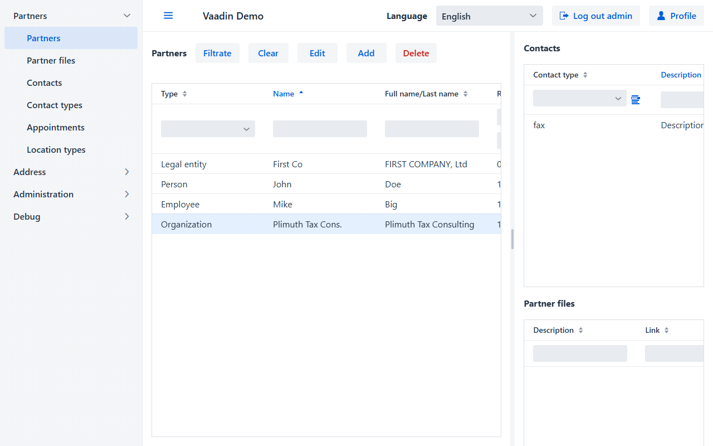
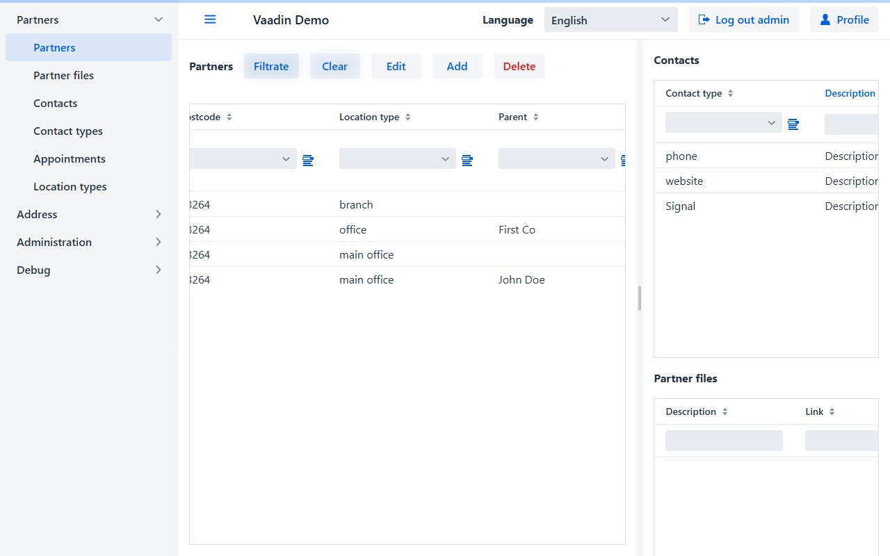
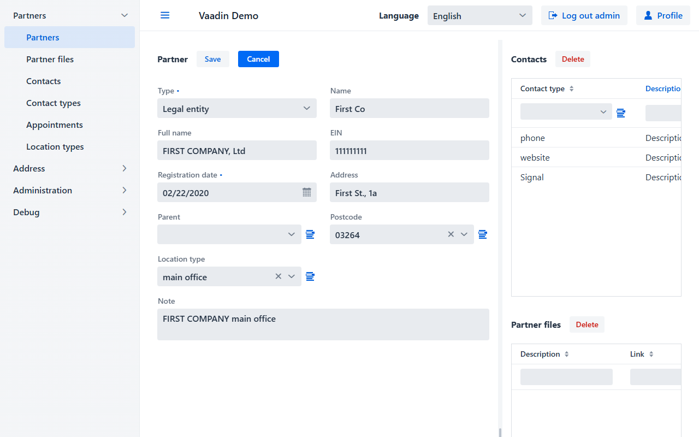
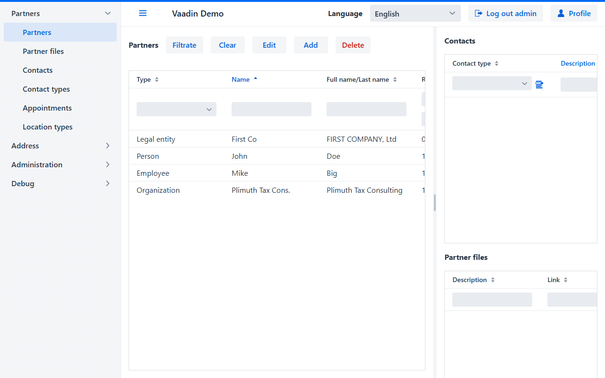
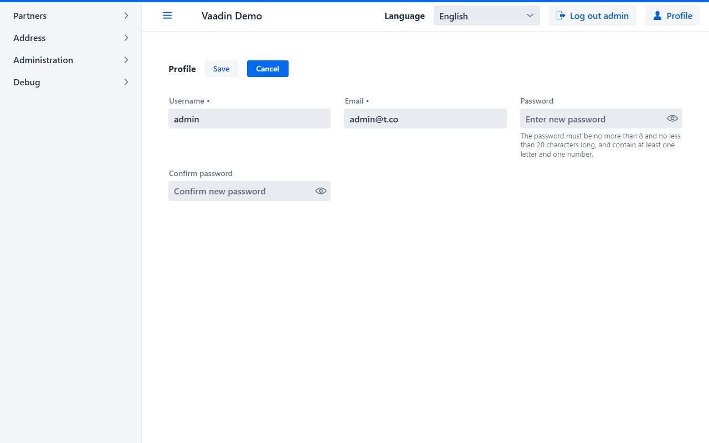
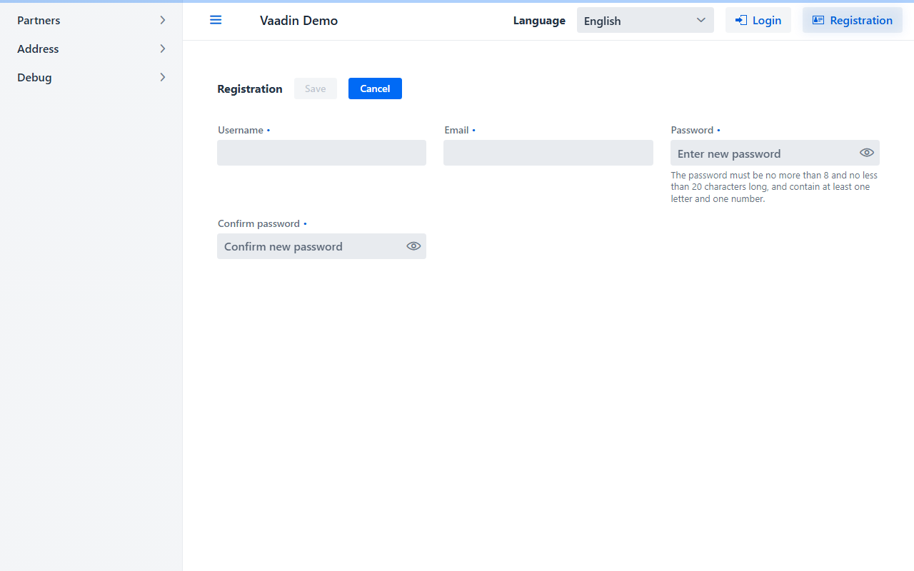

<p>
  <a href="readme.md">EN</a>
  <a href="readme.ru.md">RU</a>
</p>
<h1 align="center">biz.softfor.vaadin</h1>


— це фреймворк на базі компонентів [Vaadin](https://vaadin.com/components) та
базового класу CRUD-сервісу
[biz.softfor.spring.jpa.crud](../biz.softfor.spring.jpa.crud) для побудови
CRUD-інтерфейсу корпоративних додатків. Він надає наступні унікальні можливості:
- **не вимагає високої кваліфікації** програмістів для створення складних
інтерфейсів;
- **мінімальна кількість необхідного коду** для відображення та редагування
складних даних, включаючи ManyToMany, OneToMany, ManyToOne та OneToOne відносини;
- гнучке **розмежування доступу** до пунктів меню, перегляду та редагування
полів даних;
- табличні компоненти з фільтрами та сортуванням;
- наскрізна **локалізація** програми;
- готові сторінки логіну, **реєстрації** та **профілю** користувача.

## Приклад

Давайте створимо інтерфейс для роботи з **довідником посад**


Маємо Entity-клас
**[Appointment](../biz.softfor.partner.jpa/src/main/java/biz/softfor/partner/jpa/Appointment.java)**:
```java
@Entity
@Table(name = Appointment.TABLE)
@Getter
@Setter
@ToString(callSuper = true)
@JsonFilter("Appointment")
public class Appointment extends IdEntity<Short> implements Serializable {

  public final static String TABLE = "appointments";
  public final static String TITLE = "appointment";

  @Column
  @NotBlank
  @Size(min = 2, max = 63)
  private String name;

  @Column
  @NotBlank
  @Size(min = 2, max = 255)
  private String descr;

  private final static long serialVersionUID = 0L;

}
```

та **сервіс** для роботи з БД:
**[AppointmentSvc](../biz.softfor.partner.spring/src/main/java/biz/softfor/partner/spring/AppointmentSvc.java)**
```java
@Service
public class AppointmentSvc
extends CrudSvc<Short, Appointment, AppointmentWor, AppointmentFltr> {}
```
де ***AppointmentWor*** та ***AppointmentFltr*** - класи, згенеровані
процесорами анотацій
[biz.softfor.jpa.withoutrelationsgen](../biz.softfor.jpa.withoutrelationsgen) та
[biz.softfor.jpa.filtergen](../biz.softfor.jpa.filtergen) відповідно у проектах
[biz.softfor.partner.jpa.withoutrelations](../biz.softfor.partner.jpa.withoutrelations)
та [biz.softfor.partner.api.filter](../biz.softfor.partner.api.filter).

Для реалізації повноцінного CRUD-інтерфейсу нам знадобляться наступні
компоненти Spring.

Форма для створення/редагування/перегляду
**[AppointmentForm](../biz.softfor.vaadin.demo/src/main/java/biz/softfor/vaadin/partner/AppointmentForm.java)**:
```java
@SpringComponent
@Scope(scopeName = ConfigurableBeanFactory.SCOPE_PROTOTYPE)
public class AppointmentForm
extends EntityForm<Short, Appointment, AppointmentWor> {

  public AppointmentForm(SecurityMgr securityMgr, Validator validator) {
    super(
      Appointment.TITLE
    , new FormColumns(
        securityMgr
      , Appointment.class
      , AppointmentWor.class
      , new LinkedHashMap<String, Component>() {{
          TextField name = new TextField(Appointment_.NAME);
          put(Appointment_.NAME, name);
          TextField descr = new TextField(Appointment_.DESCR);
          put(Appointment_.DESCR, descr);
        }}
      )
    , validator
    );
  }

}
```

Далі задаємо список колонок для табличного відображення
**[AppointmentDbGridColumns](../biz.softfor.vaadin.demo/src/main/java/biz/softfor/vaadin/partner/AppointmentDbGridColumns.java)**:
```java
@SpringComponent
@Scope(scopeName = ConfigurableBeanFactory.SCOPE_PROTOTYPE)
public class AppointmentDbGridColumns extends DbGridColumns<Short, Appointment> {

  public static List<Order> DEFAULT_SORT
  = List.of(new Order(Order.Direction.ASC, Appointment_.NAME));

  public AppointmentDbGridColumns(SecurityMgr securityMgr) {
    super(
      Appointment.TABLE
    , securityMgr
    , Appointment.class
    , new TextDbGridColumn<>(Appointment_.NAME, AppointmentFltr::setName)
    , new TextDbGridColumn<>(Appointment_.DESCR, AppointmentFltr::setDescr)
    );
  }

  @Override
  public List<Order> sort() {
    return DEFAULT_SORT;
  }

}
```

Компонент для відображення табличних даних
**[AppointmentsDbGrid](../biz.softfor.vaadin.demo/src/main/java/biz/softfor/vaadin/partner/AppointmentsDbGrid.java)**:
```java
@SpringComponent
@Scope(scopeName = ConfigurableBeanFactory.SCOPE_PROTOTYPE)
public class AppointmentsDbGrid
extends DbGrid<Short, Appointment, AppointmentWor> {

  public AppointmentsDbGrid
  (AppointmentSvc service, AppointmentDbGridColumns columns) {
    super(service, AppointmentRequest.Read.class, columns, DbGridColumns.EMPTY);
  }

}
```

І, нарешті, те, що Ви бачите на скріншоті, клас
**[AppointmentsView](../biz.softfor.vaadin.demo/src/main/java/biz/softfor/vaadin/partner/AppointmentsView.java)**:
```java
@SpringComponent
@Scope(scopeName = ConfigurableBeanFactory.SCOPE_PROTOTYPE)
@AnonymousAllowed
@Route(value = AppointmentsView.PATH, layout = MainLayout.class)
public class AppointmentsView
extends EntityView<Short, Appointment, AppointmentWor> {

  public final static String PATH = "appointment";

  public AppointmentsView
  (AppointmentsDbGrid dbGrid, AppointmentForm form, SecurityMgr securityMgr) {
    super(
      dbGrid
    , AppointmentRequest.Update.class
    , AppointmentRequest.Delete.class
    , GridFields.EMPTY
    , form
    , securityMgr
    );
  }

}
```
Тут другий та третій параметри - класи для створення об'єктів відповідних
запитів, згенеровані процесором анотацій у проекті
[biz.softfor.partner.jpa.withoutrelations](../biz.softfor.partner.jpa.withoutrelations),
а четвертий – список елементів для відображення відношень **ManyToMany** та
**OneToMany**.

## Компоненти пакету biz.softfor.vaadin

- [BasicView](src/main/java/biz/softfor/vaadin/BasicView.java) - базовий
View-клас, що реалізує відображення заголовка поточної сторінки в браузері
залежно від вибраної мови. Приклад використання:
[NotFoundView](src/main/java/biz/softfor/vaadin/NotFoundView.java).


- [EntityForm](src/main/java/biz/softfor/vaadin/EntityForm.java) - відображає
форму для створення та редагування запису відповідно до заданих прав
доступу та забезпечує валідацію введених даних у відповідності з анотаціями
Java Bean Validation. Крім наведеного вище, ось більш складний приклад:
[PartnerForm](../biz.softfor.vaadin.demo/src/main/java/biz/softfor/vaadin/partner/PartnerForm.java).


- [EntityFormColumns](src/main/java/biz/softfor/vaadin/EntityFormColumns.java) -
*Map* компонентів, дозволених для перегляду та редагування. Приклад використання:
[PartnerForm](../biz.softfor.vaadin.demo/src/main/java/biz/softfor/vaadin/partner/PartnerForm.java#L97).

- [EntityView](src/main/java/biz/softfor/vaadin/EntityView.java) - відображає
дані в табличній формі, включаючи відношення **ManyToMany** та **OneToMany**,
відповідно до заданих прав доступу. Дані можуть бути відсортовані
за кількома колонками, відфільтровані як по колонці, так і за вмістом
декількох колонок або за власним методом. Приклад використання:
[PartnersView](../biz.softfor.vaadin.demo/src/main/java/biz/softfor/vaadin/partner/PartnersView.java).



- [LangSelector](src/main/java/biz/softfor/vaadin/LangSelector.java) - вибір
мови інтерфейсу зі списку, який задається в **application.properties**:
```properties
biz.softfor.locales=en,uk
```
При цьому у Вас мають бути додані переведені значення для відповідних
мов у вихідний код файлів локалізації. Інакше в процесі збірки програми при
генерації ***.messages** файлів відсутні значення будуть замінені значеннями
за замовчуванням, які відповідають першій мові в цьому списку. Також у логах Ви
знайдете попередження про кожну таку заміну. Докладніше про це дивіться у
[biz.softfor.i18nutil](../biz.softfor.i18nutil)
Приклад використання:
[MainLayout](src/main/java/biz/softfor/vaadin/MainLayout.java#L51).


- [MainLayout](src/main/java/biz/softfor/vaadin/MainLayout.java) - містить меню,
заголовок програми, перемикач мови, кнопки входу/виходу та реєстрації/профілю.
Приклад використання:
[PartnersView](../biz.softfor.vaadin.demo/src/main/java/biz/softfor/vaadin/partner/PartnersView.java#L27).

- [MenuItemData](src/main/java/biz/softfor/vaadin/MenuItemData.java) - містить
дані для створення ієрархічного меню. Приклад використання:
[PartnersView](../biz.softfor.vaadin.demo/src/main/java/biz/softfor/vaadin/demo/App.java#L61).

- [NotFoundView](src/main/java/biz/softfor/vaadin/NotFoundView.java) - компонент
з повідомленням, що запитувану сторінку не знайдено.

- [SideNavLocalized](src/main/java/biz/softfor/vaadin/SideNavLocalized.java) -
бічне меню. Приклад використання як спадкоємця SideNav:
[MainLayout](src/main/java/biz/softfor/vaadin/MainLayout.java#L42).

- [Text](src/main/java/biz/softfor/vaadin/Text.java) - загальновживані слова
та фрази в корпоративних додатках. Ці рядки використовуються як ключі для
підсистеми інтернаціоналізації.

## Компоненти пакету biz.softfor.vaadin.dbgrid

- [DbGrid](src/main/java/biz/softfor/vaadin/dbgrid/DbGrid.java) - містить
табличне відображення даних з можливостями сортування та фільтрації,
можливості видалення, створення та редагування записів. Приклад використання:
[PartnersDbGrid](../biz.softfor.vaadin.demo/src/main/java/biz/softfor/vaadin/partner/PartnersDbGrid.java).

- [DbGridColumn](src/main/java/biz/softfor/vaadin/dbgrid/DbGridColumn.java) -
базовий клас для компонентів, що описують колонку DbGrid, що реалізують методи
відображення та фільтрації даних. Оскільки фільтрація даних вимагає звернення до
бази даних, вона виконується за натисканням кнопки "Filtrate".

- [DbGridColumns](src/main/java/biz/softfor/vaadin/dbgrid/DbGridColumns.java) -
фільтрований відповідно до прав доступу список колонок для DbGrid.
Приклад використання:
[PartnerDbGridColumns](../biz.softfor.vaadin.demo/src/main/java/biz/softfor/vaadin/partner/PartnerDbGridColumns.java).

- [BoolDbGridColumn](src/main/java/biz/softfor/vaadin/dbgrid/BoolDbGridColumn.java) -
компонент для відображення булевих значень, може мати стан
"не визначено", необхідний для відображення та фільтрації NULL-значень.
Приклад використання:
[RoleDbGridColumns](../biz.softfor.vaadin.demo/src/main/java/biz/softfor/vaadin/user/RoleDbGridColumns.java#L35).
<p align="center"></p>

- [DateDbGridColumn](src/main/java/biz/softfor/vaadin/dbgrid/DateDbGridColumn.java) -
компонент для відображення дат та фільтрації за діапазоном. Приклад використання:
[PartnerDbGridColumns](../biz.softfor.vaadin.demo/src/main/java/biz/softfor/vaadin/partner/PartnerDbGridColumns.java#L57)
<p align="center"></p>

- [ComboBoxDbGridColumn](src/main/java/biz/softfor/vaadin/dbgrid/ComboBoxDbGridColumn.java) -
ComboBox для відображення та фільтрації наборів значень може мати стан
"не визначено", необхідний для відображення та фільтрації NULL-значень.
Приклад використання:
[PartnerDbGridColumns](../biz.softfor.vaadin.demo/src/main/java/biz/softfor/vaadin/partner/PartnerDbGridColumns.java#L53)
<p align="center"></p>

- [ManyToOneDbGridColumn](src/main/java/biz/softfor/vaadin/dbgrid/ManyToOneDbGridColumn.java) -
компонент для відображення та фільтрації ManyToOne-колонки, іншими словами -
значення з довідника щодо ідентифікатора. Приклад використання:
[PartnerDbGridColumns](../biz.softfor.vaadin.demo/src/main/java/biz/softfor/vaadin/partner/PartnerDbGridColumns.java#L60)



- [NumberDbGridColumn](src/main/java/biz/softfor/vaadin/dbgrid/NumberDbGridColumn.java) -
компонент для відображення та фільтрації Short, Integer та Long значень.
Приклад використання:
[RoleDbGridColumns](../biz.softfor.vaadin.demo/src/main/java/biz/softfor/vaadin/user/RoleDbGridColumns.java#L64).
<p align="center"></p>

- [TextDbGridColumn](src/main/java/biz/softfor/vaadin/dbgrid/TextDbGridColumn.java) -
компонент для відображення та фільтрації текстових значень. Приклад використання:
[RoleDbGridColumns](../biz.softfor.vaadin.demo/src/main/java/biz/softfor/vaadin/user/RoleDbGridColumns.java#L34).
<p align="center"></p>

## Компоненти пакету biz.softfor.vaadin.field

- [DateRangePicker](src/main/java/biz/softfor/vaadin/field/DateRangePicker.java) -
вибір діапазону дат. Приклад використання:
[DateDbGridColumn](src/main/java/biz/softfor/vaadin/dbgrid/DateDbGridColumn.java#L31)

- [ManyToOneField](src/main/java/biz/softfor/vaadin/field/ManyToOneField.java) -
вибір значення із довідника. Приклад використання:
[PartnerForm](../biz.softfor.vaadin.demo/src/main/java/biz/softfor/vaadin/partner/PartnerForm.java#L117).


- [ToManyField](src/main/java/biz/softfor/vaadin/field/ToManyField.java) -
відображення та редагування списку **OneToMany** та **ManyToMany** зв'язків.
Приклад використання для OneToMany (Contacts):
[PartnerForm](../biz.softfor.vaadin.demo/src/main/java/biz/softfor/vaadin/partner/PartnerForm.java#L141).



Та для ManyToMany (Groups):
[UserForm](../biz.softfor.vaadin.demo/src/main/java/biz/softfor/vaadin/user/UserForm.java#L31).


У режимі "тільки для читання" немає кнопок видалення та додавання.

## Компоненти пакету biz.softfor.vaadin.field.grid

- [GridField](src/main/java/biz/softfor/vaadin/field/grid/GridField.java) -
містить табличне відображення даних з можливостями сортування та фільтрації.
На відміну від DbGrid працює із попередньо завантаженими у пам'ять даними.
І тому фільтрація вмісту Grid виконується відразу під час введення.
Приклад використання (Contacts, Partner files, Users):
[PartnersView](../biz.softfor.vaadin.demo/src/main/java/biz/softfor/vaadin/partner/PartnersView.java#L47).



- [GridFields](src/main/java/biz/softfor/vaadin/field/grid/GridFields.java) -
список полів GridField для відображення пов'язаних ***ToMany** записів спільно з
DbGrid у складі EntityView. Приклад використання:
[PartnersView](../biz.softfor.vaadin.demo/src/main/java/biz/softfor/vaadin/partner/PartnersView.java#L44).

- [GridFieldColumn](src/main/java/biz/softfor/vaadin/field/grid/GridFieldColumn.java) -
базовий клас для компонентів, що описують колонку GridField та реалізують методи
відображення та фільтрації даних. Приклад використання:
[ContactGridFieldColumns](../biz.softfor.vaadin.demo/src/main/java/biz/softfor/vaadin/partner/ContactGridFieldColumns.java#L31).

- [GridFieldColumns](src/main/java/biz/softfor/vaadin/field/grid/GridFieldColumns.java) -
фільтрований відповідно до прав доступу список колонок для GridField.
Приклад використання:
[ContactGridFieldColumns](../biz.softfor.vaadin.demo/src/main/java/biz/softfor/vaadin/partner/ContactGridFieldColumns.java).

- [BoolGridFieldColumn](src/main/java/biz/softfor/vaadin/field/grid/BoolGridFieldColumn.java) -
компонент для відображення булевих значень, може мати стан
"не визначено", необхідний для відображення та фільтрації NULL-значень.
Приклад використання:
[ContactGridFieldColumns](../biz.softfor.vaadin.demo/src/main/java/biz/softfor/vaadin/partner/ContactGridFieldColumns.java#L47).
<p align="center"></p>

- [ComboBoxGridFieldColumn](src/main/java/biz/softfor/vaadin/field/grid/ComboBoxGridFieldColumn.java) -
ComboBox для відображення та фільтрації наборів значень, може мати стан
"не визначено", необхідне для відображення та фільтрації NULL-значень.

- [NumberGridFieldColumn](src/main/java/biz/softfor/vaadin/field/grid/NumberGridFieldColumn.java) -
компонент для відображення та фільтрації Short, Integer та Long значень. Приклад
використання:
[RoleGridFieldColumns](../biz.softfor.vaadin.demo/src/main/java/biz/softfor/vaadin/user/RoleGridFieldColumns.java#L47).
<p align="center"></p>

- [TextGridFieldsColumn](src/main/java/biz/softfor/vaadin/field/grid/TextGridFieldsColumn.java) -
компонент для відображення та фільтрації текстових значень. Приклад використання:
[RoleGridFieldColumns](../biz.softfor.vaadin.demo/src/main/java/biz/softfor/vaadin/user/RoleGridFieldColumns.java#L25).
<p align="center"></p>

## Компоненти пакету biz.softfor.vaadin.security

- [LoginView](src/main/java/biz/softfor/vaadin/security/LoginView.java) -
сторінка входу в програму, зібрана на базі Vaadin LoginForm з додаванням
локалізації та переходу на сторінку, з якою користувач здійснив вхід.


- [ProfileView](src/main/java/biz/softfor/vaadin/security/ProfileView.java) -
дає можливість користувачеві переглядати та редагувати власні
(і лише власні) дані. При цьому пароль побачити неможливо, можна лише
ввести новий.



- [RegistrationView](src/main/java/biz/softfor/vaadin/security/RegistrationView.java) -
форма реєстрації нового користувача. При цьому він отримує права доступу
замовчуванням, змінити які може лише адміністратор.



## Ліцензія

Цей проект має ліцензію MIT - подробиці дивіться у файлі [license.md](license.md).
