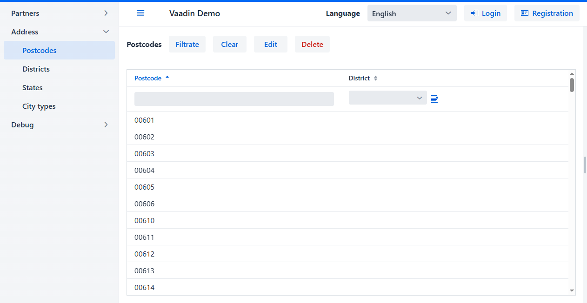

<h1 align="center">biz.softfor</h1>

— is a set of libraries, Spring Boot starters and annotation processors for
quickly creating CRUD logic for services and enterprise applications based on
JPA, Hibernate, Spring Boot and Vaadin with simple definition of the composition
of the requested data, flexible filtering when reading, updating, deleting,
fine-grained access control.

**[SoftFor.Biz](http://softfor.biz)** - this is the maximum result with a
minimum amount of necessary code and low requirements for the qualifications of
developers.

**[SoftFor.Biz](http://softfor.biz)** allows you to focus on business logic and
not drown the project at the start in a sea of ​​technological details.

- [biz.softfor.bom](biz.softfor.bom) - BOM (bill of materials).
- [biz.softfor.codegen](biz.softfor.codegen) - common code for code-generating
annotation processors.
- [biz.softfor.i18nutil](biz.softfor.i18nutil) - utility for generating
localization messages files.
- [biz.softfor.jpa](biz.softfor.jpa) - class library for creating CRUD services
based on JPA and Hibernate.
- [biz.softfor.jpa.apigen](biz.softfor.jpa.apigen) - annotation processor that
generates classes for working with CRUD API: DTO, requests and responses.
- [biz.softfor.jpa.filtergen](biz.softfor.jpa.filtergen) - annotation processor
that generates filter classes for read, update, and delete queries.
- [biz.softfor.jpa.withoutrelationsgen](biz.softfor.jpa.withoutrelationsgen) -
annotation processor that generates Entity classes without @OneToMany,
@ManyToOne and @ManyToMany annotations according to certain rules.
- [biz.softfor.logback](biz.softfor.logback) - Spring Boot starter unifying
logging parameters of applications in which it is included as a dependency.
- [biz.softfor.partner.api](biz.softfor.partner.api) - contains generated CRUD
API classes (DTO, requests and responses) for entities from
[biz.softfor.partner.jpa](biz.softfor.partner.jpa) project packages.
- [biz.softfor.partner.api.filter](biz.softfor.partner.api.filter) - contains
generated filter classes for entities from
[biz.softfor.partner.jpa](biz.softfor.partner.jpa) project packages.
- [biz.softfor.partner.i18n](biz.softfor.partner.i18n) - data for generating
[biz.softfor.partner.jpa](biz.softfor.partner.jpa) package localization files.
- [biz.softfor.partner.jpa](biz.softfor.partner.jpa) - contains classes of JPA
entities of the demonstration subject area "Partner", such as positions,
contacts, personal data, etc.
- [biz.softfor.partner.jpa.withoutrelations](biz.softfor.partner.jpa.withoutrelations) -
contains generated JPA entity classes without relations of the "Partner" demo
subject area.
- [biz.softfor.partner.spring](biz.softfor.partner.spring) - Spring Boot starter,
containing Spring CRUD services working with entities of the demo subject area
"Partner".
- [biz.softfor.partner.spring.rest](biz.softfor.partner.spring.rest) - Spring
Boot starter containing REST controllers working with CRUD services of the
"Partner" demo domain.
- [biz.softfor.reflectionsutil](biz.softfor.reflectionsutil) - utility for
scanning and saving to a file a list of classes annotated with a given
annotation.
- [biz.softfor.spring](biz.softfor.spring) - Spring Boot starter that configures
a JSON mapper, a localization bean, and defines a number of constants.
- [biz.softfor.spring.i18nrest](biz.softfor.spring.i18nrest) - Spring Boot
starter configuring REST service localization via HTTP header "Accept-Language".
- [biz.softfor.spring.jpa.crud](biz.softfor.spring.jpa.crud) - Spring Boot
starter that configures the base class of CRUD services.
- [biz.softfor.spring.jpa.properties](biz.softfor.spring.jpa.properties) -
Spring Boot starter that unifies default configuration options for JPA,
Hibernate, Flyway and DataSource.
- [biz.softfor.spring.rest](biz.softfor.spring.rest) - Spring Boot starter,
defining useful beans for REST API, such as healthcheck controller, error
handler, request logging, etc.
- [biz.softfor.spring.rest.demo](biz.softfor.spring.rest.demo) - demo REST
service.
- [biz.softfor.spring.rest.pingdb.jpa](biz.softfor.spring.rest.pingdb.jpa) -
Spring Boot starter defining a healthcheck controller for the database.
- [biz.softfor.spring.restcontrollergen](biz.softfor.spring.restcontrollergen) -
an annotation processor that generates REST controller classes based on
CRUD services.
- [biz.softfor.spring.security](biz.softfor.spring.security) - Spring Boot
starter containing beans and helper methods for Spring Security.
- [biz.softfor.spring.security.service](biz.softfor.spring.security.service) -
Spring Boot starter containing beans and helper methods for Spring Security in
REST services.
- [biz.softfor.spring.servicegen](biz.softfor.spring.servicegen) - annotation
processor that generates CRUD service classes.
- [biz.softfor.spring.ws](biz.softfor.spring.ws) - Spring Boot starter,
facilitating the construction of SOAP services.
- [biz.softfor.spring.ws.client.demo](biz.softfor.spring.ws.client.demo) -
demo SOAP client.
- [biz.softfor.spring.ws.demo](biz.softfor.spring.ws.demo) - demo SOAP server.
- [biz.softfor.testutil](biz.softfor.testutil) - a set of useful utilities for
testing.
- [biz.softfor.testutil.jpa](biz.softfor.testutil.jpa) - a set of useful
utilities for testing code using JPA.
- [biz.softfor.testutil.spring](biz.softfor.testutil.spring) - a set of useful
utilities for testing Spring Rest API.
- [biz.softfor.user.api](biz.softfor.user.api) - contains generated CRUD API
classes (DTO, requests and responses) for entities from
[biz.softfor.user.jpa](biz.softfor.user.jpa) project packages.
- [biz.softfor.user.api.filter](biz.softfor.user.api.filter) - contains
generated filter classes for entities from
[biz.softfor.user.jpa](biz.softfor.user.jpa) project packages.
- [biz.softfor.user.i18n](biz.softfor.user.i18n) - data for generating files
localization [biz.softfor.user.jpa](biz.softfor.user.jpa) package.
- [biz.softfor.user.jpa](biz.softfor.user.jpa) - contains classes of JPA
entities of the "User" subject area - users, user groups, roles and tokens.
- [biz.softfor.user.jpa.withoutrelations](biz.softfor.user.jpa.withoutrelations) -
contains classes of JPA entities without relations of the subject area "User".
- [biz.softfor.user.spring](biz.softfor.user.spring) - contains classes of JPA
entities without relations of the "User" domain.
- [biz.softfor.user.spring.rest](biz.softfor.user.spring.rest) - Spring Boot
starter containing Spring CRUD services working with entities of the "User"
domain.
- [biz.softfor.user.spring.ws](biz.softfor.user.spring.ws) - Spring Boot starter
containing SOAP services working with entities of the "User" domain.
- [biz.softfor.util](biz.softfor.util) - library of utilities used in the
framework.
- [biz.softfor.util.i18n](biz.softfor.util.i18n) - data for generating
localization files for the [biz.softfor.util](biz.softfor.util) utility package.
- [biz.softfor.vaadin](biz.softfor.vaadin) - a library of components and
helper classes for rapid implementing CRUD-UI based on Vaadin and
[biz.softfor.spring.jpa.crud](biz.softfor.spring.jpa.crud) project.
- [biz.softfor.vaadin.demo](biz.softfor.vaadin.demo) - Vaadin application for
demonstrating the capabilities of the framework.
- [biz.softfor.vaadin.demo.i18n](biz.softfor.vaadin.demo.i18n) - data for
generating localization files for the demo Vaadin application.
- [biz.softfor.vaadin.i18n](biz.softfor.vaadin.i18n) - data for generating
[biz.softfor.vaadin](biz.softfor.vaadin) project localization files.

## License

This project is licensed under the MIT License - see the [license.md](license.md) file for details.
