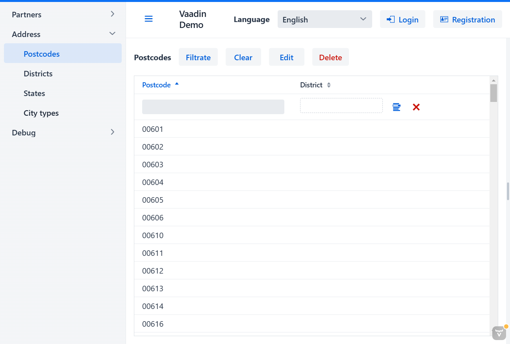

<h1 align="center">biz.softfor</h1>

— это набор библиотек, Spring Boot стартеров и процессоров аннотаций для
быстрого создания CRUD-логики сервисов и корпоративных приложений на основе
JPA, Hibernate, Spring Boot и Vaadin c простым определением состава
запрашиваемых данных, гибкой фильтрацией при чтении, обновлении, удалении,
детальным контролем доступа.

**[SoftFor.Biz](http://softfor.biz)** - это максимальный результат при
минимальном количестве необходимого кода и невысоких требованиях к квалификации
разработчиков.

**[SoftFor.Biz](http://softfor.biz)** позволяет сосредоточиться на бизнес-логике
и не утопить проект на старте в море технологических деталей.

- [biz.softfor.bom](biz.softfor.bom) - BOM (bill of materials).
- [biz.softfor.codegen](biz.softfor.codegen) - общий код для кодогенерирующих
процессоров аннотаций.
- [biz.softfor.jpa](biz.softfor.jpa) - библиотека классов для создания
CRUD-сервисов на основе JPA и Hibernate.
- [biz.softfor.jpa.apigen](biz.softfor.jpa.apigen) - процессор аннотаций,
генерирующий классы для работы с CRUD API: DTO, запросов и ответов.
- [biz.softfor.jpa.filtergen](biz.softfor.jpa.filtergen) - процессор аннотаций,
генерирующий классы фильтров для запросов чтения, обновления и удаления.
- [biz.softfor.jpa.withoutrelationsgen](biz.softfor.jpa.withoutrelationsgen) -
процессор аннотаций, генерирующий по определённым правилам классы Entity без
@OneToMany, @ManyToOne и @ManyToMany аннотаций.
- [biz.softfor.logback](biz.softfor.logback) - Spring Boot стартер,
унифицирующий параметры логирования приложений, в которые он включен как
зависимость.
- [biz.softfor.partner.api](biz.softfor.partner.api) - содержит сгенерированные
классы CRUD API (DTO, запросов и ответов) для сущностей из пакетов проекта
[biz.softfor.partner.jpa](biz.softfor.partner.jpa).
- [biz.softfor.partner.api.filter](biz.softfor.partner.api.filter) - содержит
сгенерированные классы фильтров для сущностей из пакетов проекта
[biz.softfor.partner.jpa](biz.softfor.partner.jpa).
- [biz.softfor.partner.i18n](biz.softfor.partner.i18n) - данные для генерации
файлов локализации пакета [biz.softfor.partner.jpa](biz.softfor.partner.jpa).
- [biz.softfor.partner.jpa](biz.softfor.partner.jpa) - содержит классы
JPA-сущностей демонстрационной предметной области "Партнер", такие как должности,
контакты, персональные данные и пр.
- [biz.softfor.partner.jpa.withoutrelations](biz.softfor.partner.jpa.withoutrelations) -
содержит классы JPA-сущностей без отношений (relations) демонстрационной
предметной области "Партнер".
- [biz.softfor.partner.spring](biz.softfor.partner.spring) - Spring Boot стартер,
содержащий Spring-сервисы CRUD, работающие с сущностями демонстрационной
предметной области "Партнёр".
- [biz.softfor.partner.spring.rest](biz.softfor.partner.spring.rest) - Spring
Boot стартер, содержащий REST контроллеры, работающие с CRUD-сервисами
демонстрационной предметной области "Партнёр".
- [biz.softfor.reflectionsutil](biz.softfor.reflectionsutil) - утилита для
сканирования и сохранения в файл списка классов, аннотированных заданной
аннотацией.
- [biz.softfor.spring](biz.softfor.spring) - Spring Boot стартер,
конфигурирующий JSON-mapper, бин локализации и определяющий ряд констант.
- [biz.softfor.spring.i18nrest](biz.softfor.spring.i18nrest) - Spring Boot
стартер, конфигурирующий локализацию REST-сервиса через HTTP заголовок
"Accept-Language".
- [biz.softfor.spring.jpa.crud](biz.softfor.spring.jpa.crud) - Spring Boot
стартер, конфигурирующий базовый класс CRUD-сервисов.
- [biz.softfor.spring.jpa.properties](biz.softfor.spring.jpa.properties) -
Spring Boot стартер, унифицирующий параметры по умолчанию для конфигурации
JPA, Hibernate, Flyway и DataSource.
- [biz.softfor.spring.rest](biz.softfor.spring.rest) - Spring Boot стартер,
определяющий полезные бины для REST API, такие как healthcheck-контроллер,
обработчик ошибок, логирование запросов и пр.
- [biz.softfor.spring.rest.demo](biz.softfor.spring.rest.demo) -
демонстрационный REST-сервис.
- [biz.softfor.spring.rest.pingdb.jpa](biz.softfor.spring.rest.pingdb.jpa) -
Spring Boot стартер, определяющий healthcheck-контроллер для базы данных.
- [biz.softfor.spring.restcontrollergen](biz.softfor.spring.restcontrollergen) -
процессор аннотаций, генерирующий классы REST-контроллеров на основе
CRUD-сервисов.
- [biz.softfor.spring.security](biz.softfor.spring.security) - Spring Boot
стартер, содержащий бины и вспомогательные методы для Spring Security.
- [biz.softfor.spring.security.service](biz.softfor.spring.security.service) -
Spring Boot стартер, содержащий бины и вспомогательные методы для Spring
Security в REST-сервисах.
- [biz.softfor.spring.servicegen](biz.softfor.spring.servicegen) - процессор
аннотаций, генерирующий классы CRUD-сервисов.
- [biz.softfor.spring.ws](biz.softfor.spring.ws) - Spring Boot стартер,
облегчающий построение SOAP-сервисов.
- [biz.softfor.spring.ws.client.demo](biz.softfor.spring.ws.client.demo) -
демонстрационный SOAP-клиент.
- [biz.softfor.spring.ws.demo](biz.softfor.spring.ws.demo) - демонстрационный
SOAP-сервер.
- [biz.softfor.testutil](biz.softfor.testutil) - набор полезных утилит для
тестирования.
- [biz.softfor.testutil.jpa](biz.softfor.testutil.jpa) - набор полезных утилит
для тестирования кода с использованием JPA.
- [biz.softfor.testutil.spring](biz.softfor.testutil.spring) - набор полезных
утилит для тестирования Spring Rest API.
- [biz.softfor.user.api](biz.softfor.user.api) - содержит сгенерированные
классы CRUD API (DTO, запросов и ответов) для сущностей из пакетов проекта
[biz.softfor.user.jpa](biz.softfor.user.jpa).
- [biz.softfor.user.api.filter](biz.softfor.user.api.filter) - содержит
сгенерированные классы фильтров для сущностей из пакетов проекта
[biz.softfor.user.jpa](biz.softfor.user.jpa).
- [biz.softfor.user.i18n](biz.softfor.user.i18n) - данные для генерации файлов
локализации пакета [biz.softfor.user.jpa](biz.softfor.user.jpa).
- [biz.softfor.user.jpa](biz.softfor.user.jpa) - содержит классы JPA-сущностей
предметной области "Пользователь" - пользователи, группы пользователей, роли и
токены.
- [biz.softfor.user.jpa.withoutrelations](biz.softfor.user.jpa.withoutrelations) -
содержит классы JPA-сущностей без отношений (relations) предметной области
"Пользователь".
- [biz.softfor.user.spring](biz.softfor.user.spring) - содержит классы
JPA-сущностей без отношений (relations) предметной области "Пользователь".
- [biz.softfor.user.spring.rest](biz.softfor.user.spring.rest) - Spring Boot
стартер, содержащий Spring-сервисы CRUD, работающие с сущностями предметной
области "Пользователь".
- [biz.softfor.user.spring.ws](biz.softfor.user.spring.ws) - Spring Boot стартер,
содержащий SOAP-сервисы, работающие с сущностями предметной области
"Пользователь".
- [biz.softfor.util](biz.softfor.util) - библиотека утилит, используемых в
фреймворке.
- [biz.softfor.util.i18n](biz.softfor.util.i18n) - данные для генерации файлов
локализации пакета утилит [biz.softfor.util](biz.softfor.util).
- [biz.softfor.vaadin](biz.softfor.vaadin) - библиотека компонентов и
вспомогательных классов для быстрой реализации CRUD-UI на базе Vaadin и
[biz.softfor.spring.jpa.crud](biz.softfor.spring.jpa.crud).
- [biz.softfor.vaadin.demo](biz.softfor.vaadin.demo) - Vaadin приложение для
демонстрации возможностей фреймворка.
- [biz.softfor.vaadin.demo.i18n](biz.softfor.vaadin.demo.i18n) - данные для
генерации файлов локализации демонстрационного Vaadin-приложения.
- [biz.softfor.vaadin.i18n](biz.softfor.vaadin.i18n) - данные для генерации
файлов локализации проекта [biz.softfor.vaadin](biz.softfor.vaadin).

## Лицензия

Этот проект имеет лицензию MIT - подробности смотрите в файле [license.md](license.md).
